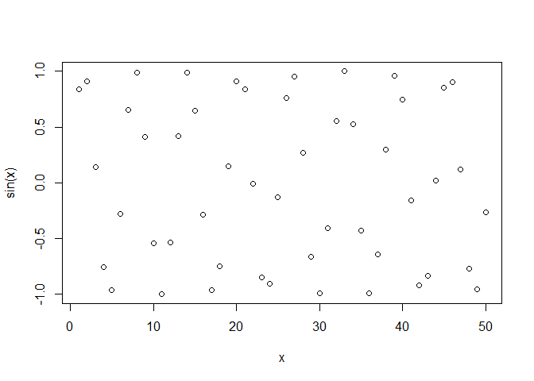
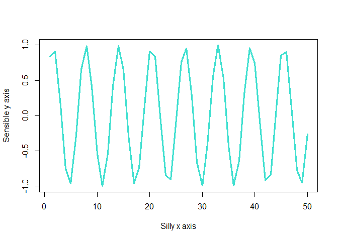

# Intro to R
Grace Wang

``` r
#Class 04 R script

x <- 1:50

plot(x, sin(x))
```



``` r
plot(x, sin(x), typ = "l", col = "turquoise", lwd = 3, 
     xlab = "Silly x axis", ylab = "Sensible y axis")
```


