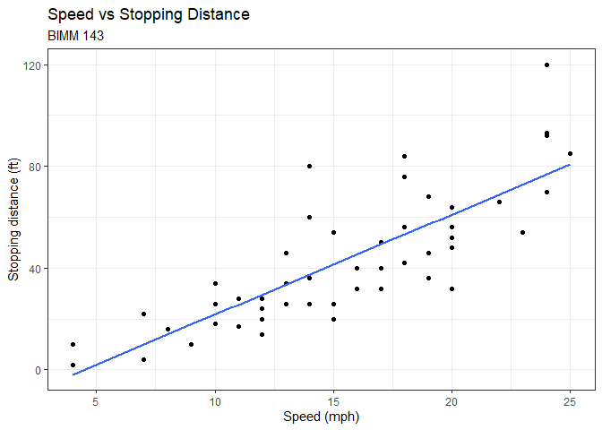
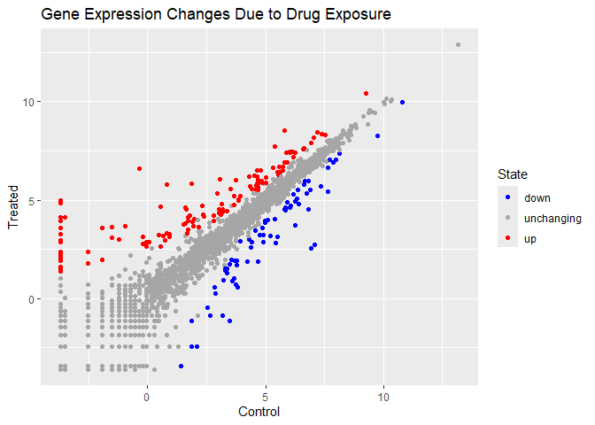
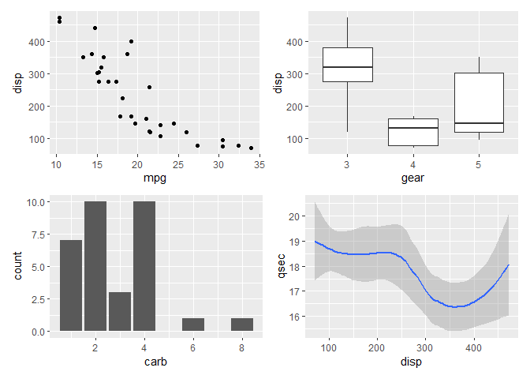
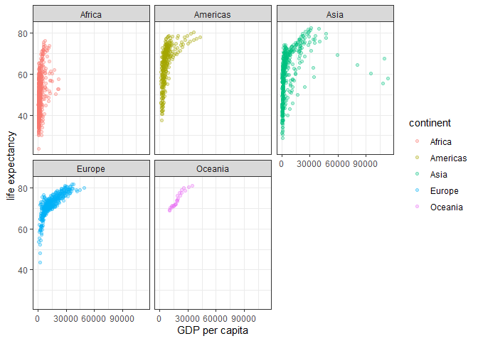

# Class 5: Data Visualization with ggplot
Grace Wang (A16968688)

- [Background](#background)
- [Gene expression plot](#gene-expression-plot)
  - [Custom color plot](#custom-color-plot)
- [Using different geoms](#using-different-geoms)
- [Gapminder](#gapminder)

# Background

R has many graphics systems, including “base R” and additional packages
such as **ggplot2**.

Let’s compare base R and **ggplot2** briefly:

Use built-in example data called `cars`.

``` r
head(cars)
```

      speed dist
    1     4    2
    2     4   10
    3     7    4
    4     7   22
    5     8   16
    6     9   10

In base R we can call `plot()`:

``` r
plot(cars)
```


How can we do this with **ggplot2**?

First, we need to install the package using
`install.packages("ggplot2")`. This only needs to be done once.

> Key point: only install packages in the R console

Now, before any add-on package can be used, it must be loaded with a
call to `library()`.

``` r
library(ggplot2)
```

    Warning: package 'ggplot2' was built under R version 4.4.3

``` r
ggplot(cars)
```


Every ggplot needs at least 3 layers:

- the **data** (e.g., `cars`)
- the **aes**thetics (how the data map to the plot)
- the **geom**etries (how the plot is drawn - e.g., lines, points,
  columns, etc)

``` r
ggplot(cars) + 
  aes(x = speed, y = dist) + 
  geom_point()
```


For “simple” plots ggplot is more verbose than base R, but the defaults
are nicer. For complicated plots it becomes much more efficient and
structured.

> Add a line to show the relationship between speed and stopping
> distance in another layer:

``` r
p <- ggplot(cars) + 
  aes(x = speed, y = dist) + 
  geom_point() + 
  geom_smooth(se = F, method = "lm")
p
```

    `geom_smooth()` using formula = 'y ~ x'


I can always save any ggplot object and use it later.

> Add a title and subtitle to the plot:

``` r
p + labs(title = "Speed vs Stopping Distance", 
         subtitle = "BIMM 143", 
         x = "Speed (mph)", 
         y = "Stopping distance (ft)") + 
  theme_bw()
```

    `geom_smooth()` using formula = 'y ~ x'



# Gene expression plot

``` r
url <- "https://bioboot.github.io/bimm143_S20/class-material/up_down_expression.txt"
genes <- read.delim(url)
head(genes)
```

            Gene Condition1 Condition2      State
    1      A4GNT -3.6808610 -3.4401355 unchanging
    2       AAAS  4.5479580  4.3864126 unchanging
    3      AASDH  3.7190695  3.4787276 unchanging
    4       AATF  5.0784720  5.0151916 unchanging
    5       AATK  0.4711421  0.5598642 unchanging
    6 AB015752.4 -3.6808610 -3.5921390 unchanging

> How many genes are in this dataset?

``` r
nrow(genes)
```

    [1] 5196

> How many columns are there?

``` r
ncol(genes)
```

    [1] 4

> What are the column names?

``` r
colnames(genes)
```

    [1] "Gene"       "Condition1" "Condition2" "State"     

> How many up- and down-regulated genes are there?

``` r
table(genes$State)
```


          down unchanging         up 
            72       4997        127 

## Custom color plot

> Make a first plot of the data

``` r
ggplot(genes) + 
  aes(x = Condition1, y = Condition2, col = State) + 
  geom_point() + 
  scale_color_manual(values = c("blue", "gray65", "red")) + 
  labs(title = "Gene Expression Changes Due to Drug Exposure", 
       x = "Control", 
       y = "Treated") + 
  theme_gray()
```



# Using different geoms

Use `mtcars`.

``` r
head(mtcars)
```

                       mpg cyl disp  hp drat    wt  qsec vs am gear carb
    Mazda RX4         21.0   6  160 110 3.90 2.620 16.46  0  1    4    4
    Mazda RX4 Wag     21.0   6  160 110 3.90 2.875 17.02  0  1    4    4
    Datsun 710        22.8   4  108  93 3.85 2.320 18.61  1  1    4    1
    Hornet 4 Drive    21.4   6  258 110 3.08 3.215 19.44  1  0    3    1
    Hornet Sportabout 18.7   8  360 175 3.15 3.440 17.02  0  0    3    2
    Valiant           18.1   6  225 105 2.76 3.460 20.22  1  0    3    1

> Scatter plot of `mpg` vs `disp`

``` r
p1 <- ggplot(mtcars) + 
  aes(x = mpg, y = disp) + 
  geom_point()
```

> Boxplot of `gear` vs `disp`

``` r
p2 <- ggplot(mtcars) + 
  aes(x = factor(gear), y = disp) + 
  geom_boxplot() + 
  labs(x = "gear")
```

> Barplot of `carb`

``` r
p3 <- ggplot(mtcars) + 
  aes(carb) + 
  geom_bar()
```

> Smooth of `disp` vs `qsec`

``` r
p4 <- ggplot(mtcars) + 
  aes(x = disp, y = qsec) + 
  geom_smooth()
```

Goal: combine all four plots into one multipanel figure.

We can use the **patchwork** package to do this.

``` r
library(patchwork)
```

    Warning: package 'patchwork' was built under R version 4.4.3

``` r
((p1 | p2) / (p3 | p4))
```

    `geom_smooth()` using method = 'loess' and formula = 'y ~ x'



Save the figure.

``` r
ggsave(filename = "mtcars_plot.png", width = 5, height = 3)
```

    `geom_smooth()` using method = 'loess' and formula = 'y ~ x'

# Gapminder

Read in `gapminder` data.

``` r
url <- "https://raw.githubusercontent.com/jennybc/gapminder/master/inst/extdata/gapminder.tsv"

gapminder <- read.delim(url)
head(gapminder)
```

          country continent year lifeExp      pop gdpPercap
    1 Afghanistan      Asia 1952  28.801  8425333  779.4453
    2 Afghanistan      Asia 1957  30.332  9240934  820.8530
    3 Afghanistan      Asia 1962  31.997 10267083  853.1007
    4 Afghanistan      Asia 1967  34.020 11537966  836.1971
    5 Afghanistan      Asia 1972  36.088 13079460  739.9811
    6 Afghanistan      Asia 1977  38.438 14880372  786.1134

> How many countries are in the dataset?

``` r
length(table(gapminder$country))
```

    [1] 142

> Plot GDP vs life expectancy, colored by continent

``` r
ggplot(gapminder) + 
  aes(x = gdpPercap, y = lifeExp, col = continent) + 
  geom_point(alpha = 0.3) + 
  labs(x = "GDP per capita", y = "life expectancy") + 
  facet_wrap(~continent) + 
  theme_bw()
```


