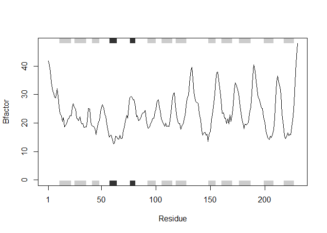
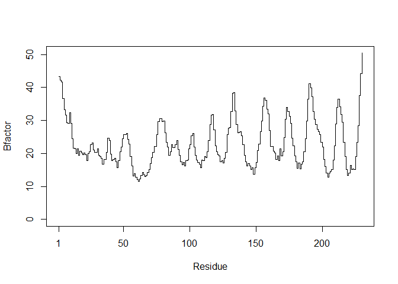

# Class 6 Homework
Grace Wang (PID: A16968688)

# Original code

``` r
library(bio3d)
```

    Warning: package 'bio3d' was built under R version 4.4.3

``` r
s1 <- read.pdb("4AKE") # kinase with drug
```

      Note: Accessing on-line PDB file

``` r
s2 <- read.pdb("1AKE") # kinase no drug
```

      Note: Accessing on-line PDB file
       PDB has ALT records, taking A only, rm.alt=TRUE

``` r
s3 <- read.pdb("1E4Y") # kinase with drug
```

      Note: Accessing on-line PDB file

``` r
s1.chainA <- trim.pdb(s1, chain="A", elety="CA")
s2.chainA <- trim.pdb(s2, chain="A", elety="CA")
s3.chainA <- trim.pdb(s3, chain="A", elety="CA")
s1.b <- s1.chainA$atom$b
s2.b <- s2.chainA$atom$b
s3.b <- s3.chainA$atom$b
plotb3(s1.b, sse=s1.chainA, typ="l", ylab="Bfactor")
```


``` r
plotb3(s2.b, sse=s2.chainA, typ="l", ylab="Bfactor")
```


``` r
plotb3(s3.b, sse=s3.chainA, typ="l", ylab="Bfactor")
```


# New function

``` r
rm(list=ls())

#Function to plot B-factor of a protein chain

  #Inputs:
    #input - PDB code as string
    #chain - which chain from PDB to use, default A
    #sse - whether to display secondary structures on plot, default T
    #typ - plot type, taken from bio3d plotb3, default l (lines)

  #Output: plot of B-factor for each residue in a protein chain

bfactorplot <- function(input, chain = "A", sse = T, typ = "l"){
  
  #Read in PDB file
  prot <- read.pdb(input)
  
  #Identify alpha carbons in designated chain
  prot.chain <- trim.pdb(prot, chain = chain,  elety = "CA")
  
  #Make vector of B-factors
  prot.b <- prot.chain$atom$b
  
  #If sse == F, remove secondary structure annotation
  if(sse == F){
    prot.chain <- NULL
  }
  
  #Plot B-factors
  plotb3(prot.b, sse = prot.chain, typ = typ, ylab = "Bfactor")
}
```

``` r
#test function
sapply(c("4AKE", "1AKE", "1E4Y"), bfactorplot)
```

      Note: Accessing on-line PDB file

    Warning in get.pdb(file, path = tempdir(), verbose = FALSE):
    C:\Users\grace\AppData\Local\Temp\Rtmp2VGcsv/4AKE.pdb exists. Skipping download


      Note: Accessing on-line PDB file

    Warning in get.pdb(file, path = tempdir(), verbose = FALSE):
    C:\Users\grace\AppData\Local\Temp\Rtmp2VGcsv/1AKE.pdb exists. Skipping download

       PDB has ALT records, taking A only, rm.alt=TRUE


      Note: Accessing on-line PDB file

    Warning in get.pdb(file, path = tempdir(), verbose = FALSE):
    C:\Users\grace\AppData\Local\Temp\Rtmp2VGcsv/1E4Y.pdb exists. Skipping download


    $`4AKE`
    NULL

    $`1AKE`
    NULL

    $`1E4Y`
    NULL

``` r
#test with different protein
bfactorplot("1GFL")
```

      Note: Accessing on-line PDB file



``` r
#test non-default inputs
bfactorplot("1GFL", chain = "B", sse = F, typ = "s")
```

      Note: Accessing on-line PDB file

    Warning in get.pdb(file, path = tempdir(), verbose = FALSE):
    C:\Users\grace\AppData\Local\Temp\Rtmp2VGcsv/1GFL.pdb exists. Skipping download


