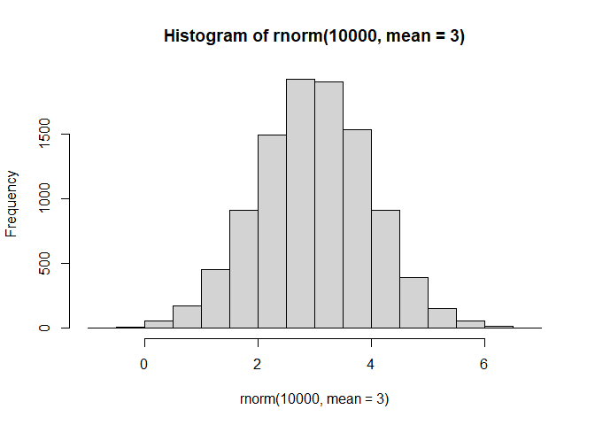
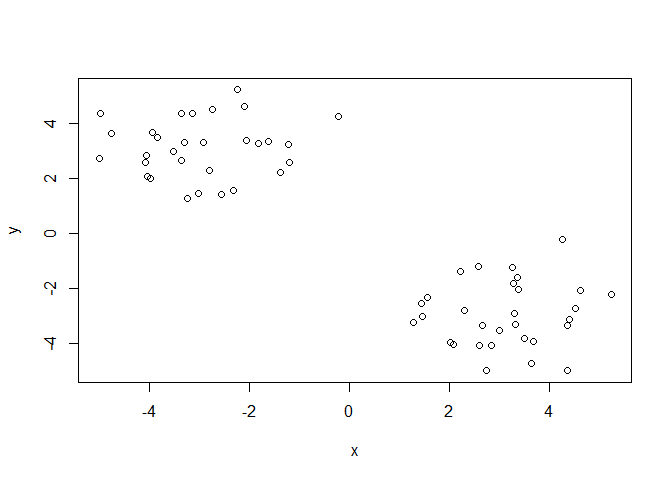
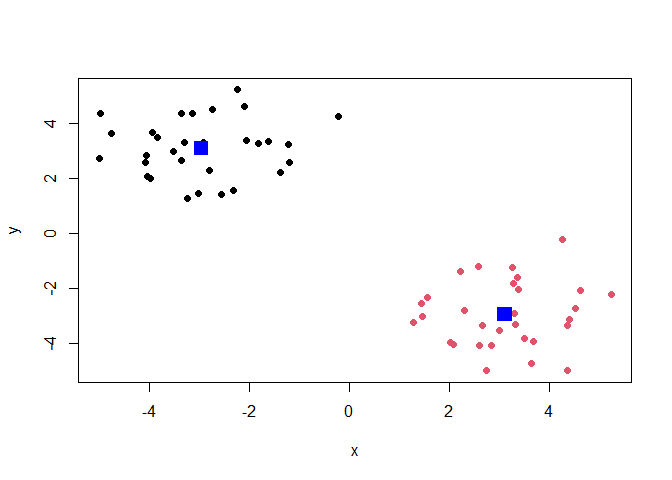
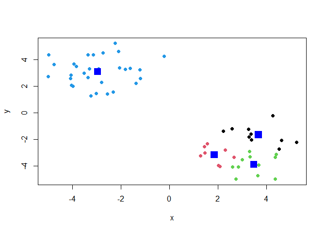
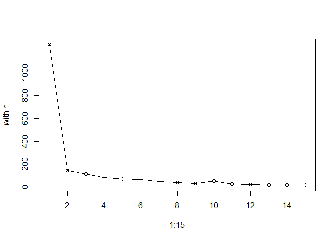
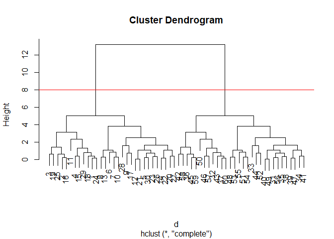
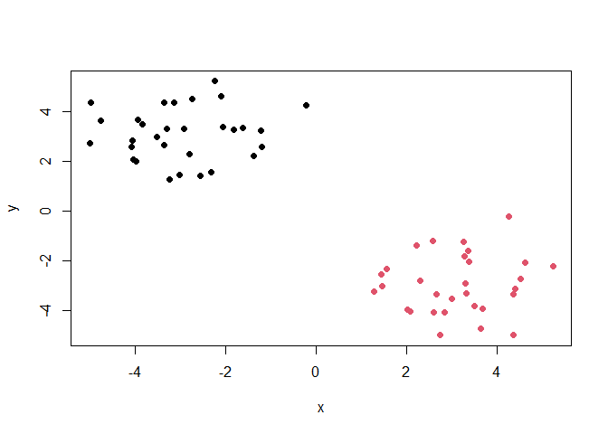
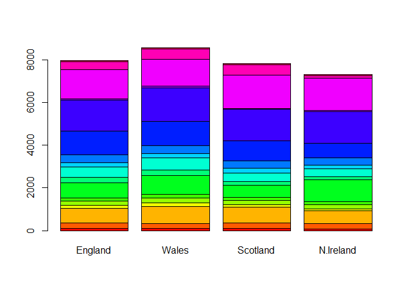
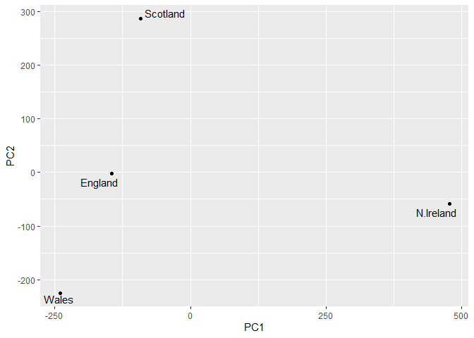
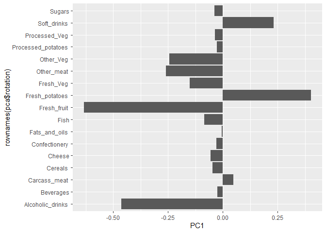

# Class 7: Machine Learning 1
Grace Wang (PID: A16968688)

- [Clustering](#clustering)
  - [K-means](#k-means)
  - [Hierarchical clustering](#hierarchical-clustering)
- [Dimensionality reduction - principal component analysis
  (PCA)](#dimensionality-reduction---principal-component-analysis-pca)
  - [Using PCA](#using-pca)
  - [Interpreting PCA results](#interpreting-pca-results)

Today we will explore unsupervised machine learning methods, beginning
with clustering and dimensionality reduction.

## Clustering

Let’s make up some data to cluster so that we know what the answer
should be. The `rnorm()` function will help here.

``` r
hist(rnorm(10000, mean = 3))
```



Return 30 numbers centered on -3.

``` r
rnorm(30, mean = -3)
```

     [1] -1.658425 -3.148919 -3.637777 -3.392637 -3.221425 -2.748146 -3.475834
     [8] -1.932017 -2.909493 -4.044768 -1.786728 -3.706034 -2.150082 -2.639822
    [15] -3.697494 -3.106689 -1.349695 -4.624334 -2.172560 -4.000573 -4.357829
    [22] -2.809370 -4.553793 -2.907509 -4.538167 -2.979361 -3.025333 -4.650029
    [29] -2.840338 -3.318723

``` r
rnorm(30, mean = 3)
```

     [1] 3.4414609 4.3794792 3.7356263 2.3670761 4.0064583 2.5021816 3.1067741
     [8] 3.0410862 4.6514413 3.3796388 3.0715228 3.1378428 3.5818561 3.0580397
    [15] 2.9303191 0.7307657 3.0755088 3.5463221 4.5114947 2.6078001 3.8027867
    [22] 3.1548461 1.9065987 3.1218896 4.9686325 4.4679923 3.3506733 4.1342791
    [29] 3.8205756 2.5965656

``` r
tmp <- c(rnorm(30, mean = -3), 
            rnorm(30, mean = 3))

x <- cbind(x = tmp, y = rev(tmp))
#x
```

Make a plot of `x`.

``` r
plot(x)
```



### K-means

The main function in base R for K-means clustering is called `kmeans()`.

``` r
km <- kmeans(x, centers = 2)
```

The `kmeans` function returns a list with 9 components. You can see the
named components of any list with the `attributes()` function.

``` r
attributes(km)
```

    $names
    [1] "cluster"      "centers"      "totss"        "withinss"     "tot.withinss"
    [6] "betweenss"    "size"         "iter"         "ifault"      

    $class
    [1] "kmeans"

> How many points are in each cluster?

``` r
km$size
```

    [1] 30 30

> Cluster assignment/membership vector

``` r
km$cluster
```

     [1] 1 1 1 1 1 1 1 1 1 1 1 1 1 1 1 1 1 1 1 1 1 1 1 1 1 1 1 1 1 1 2 2 2 2 2 2 2 2
    [39] 2 2 2 2 2 2 2 2 2 2 2 2 2 2 2 2 2 2 2 2 2 2

> Cluster centers

``` r
km$centers
```

              x         y
    1 -2.961742  3.099252
    2  3.099252 -2.961742

> Make a plot of our `kmeans()` results showing cluster assignment using
> different colors for each group of points and cluster centers in blue.
> .

``` r
plot(x, col = km$cluster, pch = 19)
points(km$centers, col = "blue", pch = 15, cex = 2)
```



> Run `kmeans()` again on `x` but cluster into 4 groups and plot the
> same result figure.

``` r
km2 <- kmeans(x, centers = 4)

plot(x, col = km2$cluster, pch = 19)
points(km2$centers, col = "blue", pch = 15, cex = 2)
```



Scree plot

``` r
within <- numeric(15)
for (n in 1:15){
  km <- kmeans(x, centers = n)
  within[n] <- km$tot.withinss
}
plot(x = 1:15, y = within)
lines(x = 1:15, y = within)
```



> **Key point** - k-means clustering is very popular but can be misused.
> One big limitation is that it can impose a clustering pattern on data
> even if clear natural groupings don’t exist - i.e., it does what you
> tell it to do with regard to the number of `centers`.

### Hierarchical clustering

The main function in base R for hierarchical clustering is `hclust()`.

You can’t just pass an input dataset as is into `hclust()`. Data must
first be made into a “distance matrix”, which can be done using the
`dist()` function.

``` r
d <- dist(x)
hc <- hclust(d)
hc
```


    Call:
    hclust(d = d)

    Cluster method   : complete 
    Distance         : euclidean 
    Number of objects: 60 

The results of `hclust()` don’t have a useful `print` method, but they
do have a special `plot` method.

``` r
plot(hc)
abline(h = 8, col = "red")
```



To get our main cluster assignment (membership vector), we need to “cut”
the tree at the big goalposts.

``` r
grps <- cutree(hc, h = 8)
table(grps)
```

    grps
     1  2 
    30 30 

``` r
plot(x, col = grps, pch = 19)
```



Hierarchical clustering is distinct in that the dendrogram can reveal
the potential grouping in your data (unlike k-means).

## Dimensionality reduction - principal component analysis (PCA)

PCA is a common and highly useful dimensionality reduction technique
used in many fields - particularly bioinformatics.

Here we will analyze some data from the UK on food consumption.

``` r
UK_foods <- read.csv(url("https://tinyurl.com/UK-foods"))

dim(UK_foods)
```

    [1] 17  5

``` r
head(UK_foods)
```

                   X England Wales Scotland N.Ireland
    1         Cheese     105   103      103        66
    2  Carcass_meat      245   227      242       267
    3    Other_meat      685   803      750       586
    4           Fish     147   160      122        93
    5 Fats_and_oils      193   235      184       209
    6         Sugars     156   175      147       139

``` r
rownames(UK_foods) <- UK_foods[, 1]
UK_foods <- UK_foods[, -1]
head(UK_foods)
```

                   England Wales Scotland N.Ireland
    Cheese             105   103      103        66
    Carcass_meat       245   227      242       267
    Other_meat         685   803      750       586
    Fish               147   160      122        93
    Fats_and_oils      193   235      184       209
    Sugars             156   175      147       139

``` r
UK_foods <- read.csv(url("https://tinyurl.com/UK-foods"), row.names = 1)
head(UK_foods)
```

                   England Wales Scotland N.Ireland
    Cheese             105   103      103        66
    Carcass_meat       245   227      242       267
    Other_meat         685   803      750       586
    Fish               147   160      122        93
    Fats_and_oils      193   235      184       209
    Sugars             156   175      147       139

``` r
barplot(as.matrix(UK_foods), beside=T, col=rainbow(nrow(UK_foods)))
```


``` r
barplot(as.matrix(UK_foods), beside=F, col=rainbow(nrow(UK_foods)))
```



``` r
pairs(UK_foods, col = rainbow(nrow(UK_foods)), pch = 16)
```


### Using PCA

The main function in base R for PCA is `prcomp()`.

``` r
UK_foods <- t(UK_foods)
pca <- prcomp(UK_foods)
summary(pca)
```

    Importance of components:
                                PC1      PC2      PC3       PC4
    Standard deviation     324.1502 212.7478 73.87622 3.176e-14
    Proportion of Variance   0.6744   0.2905  0.03503 0.000e+00
    Cumulative Proportion    0.6744   0.9650  1.00000 1.000e+00

The `prcomp()` function returns a list object of our results with 5
attributes.

``` r
attributes(pca)
```

    $names
    [1] "sdev"     "rotation" "center"   "scale"    "x"       

    $class
    [1] "prcomp"

### Interpreting PCA results

The two main “results” are `pca$x` and `pca$rotation`. The first of
these contains the scores of the data on the new PC axis - we use these
to make our PCA plot.

``` r
pca$x
```

                     PC1         PC2        PC3           PC4
    England   -144.99315   -2.532999 105.768945 -4.894696e-14
    Wales     -240.52915 -224.646925 -56.475555  5.700024e-13
    Scotland   -91.86934  286.081786 -44.415495 -7.460785e-13
    N.Ireland  477.39164  -58.901862  -4.877895  2.321303e-13

``` r
library(ggplot2)
```

    Warning: package 'ggplot2' was built under R version 4.4.3

``` r
library(ggrepel)
```

    Warning: package 'ggrepel' was built under R version 4.4.3

``` r
# Make a plot of pca$x with PC1 vs PC2
ggplot(pca$x) + 
  aes(x = PC1, y = PC2, label = rownames(pca$x)) + 
  geom_point() + 
  geom_text_repel()
```



The plot shows that England, Scotland, and Wales cluster together along
the PC1 axis while Northern Ireland is on its own. England, Scotland and
Wales are further apart along the PC2 axis, but the PC1 axis captures
the largest proportion of the variance, so there is a larger difference
between Northern Ireland and the rest of the countries.

The second major result is contained in the `pca$rotation` object or
component. Let’s plot this to see what PCA is picking up.

``` r
pca$rotation
```

                                 PC1          PC2         PC3          PC4
    Cheese              -0.056955380  0.016012850  0.02394295 -0.694538519
    Carcass_meat         0.047927628  0.013915823  0.06367111  0.489884628
    Other_meat          -0.258916658 -0.015331138 -0.55384854  0.279023718
    Fish                -0.084414983 -0.050754947  0.03906481 -0.008483145
    Fats_and_oils       -0.005193623 -0.095388656 -0.12522257  0.076097502
    Sugars              -0.037620983 -0.043021699 -0.03605745  0.034101334
    Fresh_potatoes       0.401402060 -0.715017078 -0.20668248 -0.090972715
    Fresh_Veg           -0.151849942 -0.144900268  0.21382237 -0.039901917
    Other_Veg           -0.243593729 -0.225450923 -0.05332841  0.016719075
    Processed_potatoes  -0.026886233  0.042850761 -0.07364902  0.030125166
    Processed_Veg       -0.036488269 -0.045451802  0.05289191 -0.013969507
    Fresh_fruit         -0.632640898 -0.177740743  0.40012865  0.184072217
    Cereals             -0.047702858 -0.212599678 -0.35884921  0.191926714
    Beverages           -0.026187756 -0.030560542 -0.04135860  0.004831876
    Soft_drinks          0.232244140  0.555124311 -0.16942648  0.103508492
    Alcoholic_drinks    -0.463968168  0.113536523 -0.49858320 -0.316290619
    Confectionery       -0.029650201  0.005949921 -0.05232164  0.001847469

``` r
ggplot(pca$rotation) + 
  aes(x = PC1, rownames(pca$rotation)) + 
  geom_col()
```



The figure shows how each variable contributes to PC1. We can see that
positive values for PC1 are associated with mroe soft drink and fresh
potato consumption and less fresh fruit and alcohol consumption.
