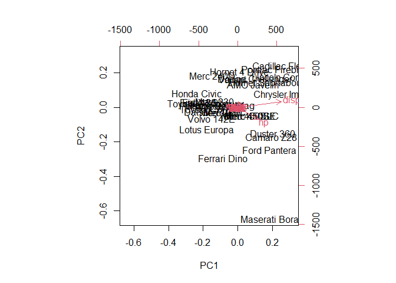

# Class 8: Mini-project
Grace Wang (PID: A16968688)

- [Background](#background)
- [Data import](#data-import)
  - [Question 1](#question-1)
  - [Question 2](#question-2)
  - [Question 3](#question-3)
- [Clustering](#clustering)
- [PCA](#pca)
  - [Scaling](#scaling)
  - [Back to cancer data](#back-to-cancer-data)
  - [Question 4](#question-4)
  - [Question 5](#question-5)
  - [Question 6](#question-6)
  - [Question 7](#question-7)
  - [Question 8](#question-8)
  - [Variance](#variance)
- [Communicating PCA results](#communicating-pca-results)
  - [Question 9](#question-9)
  - [Question 10](#question-10)
  - [Questions 11 - 14 use `hclust()` and `kmeans()`, done
    earlier/omitted](#questions-11---14-use-hclust-and-kmeans-done-earlieromitted)
- [Combining methods](#combining-methods)
  - [Question 15](#question-15)
  - [Question 16](#question-16)
- [Prediction](#prediction)
  - [Question 18](#question-18)

## Background

This mini-project explores unsupervised learning techniques applied to
the Wisconsin Breast Cancer Diagnostic Data Set, which contains
measurements of human breast mass cell nuclei. The project guides the
user through exploratory data analysis, performing and interpreting
Principal Component Analysis (PCA) to reduce the dimensionality of the
data while retaining variance, and applying hierarchical clustering with
different linkage methods. It also includes an optional section on
K-means clustering for comparison. The ultimate goal is to combine PCA
and clustering to better separate benign and malignant cell samples,
evaluating the results using metrics like sensitivity and specificity,
and finally demonstrating how to predict the classification of new
samples using the developed PCA model.

## Data import

Our data come from the University of Wisconsin Medical Center.

``` r
wisc.df <- read.csv("WisconsinCancer.csv", row.names = 1)
head(wisc.df)
```

             diagnosis radius_mean texture_mean perimeter_mean area_mean
    842302           M       17.99        10.38         122.80    1001.0
    842517           M       20.57        17.77         132.90    1326.0
    84300903         M       19.69        21.25         130.00    1203.0
    84348301         M       11.42        20.38          77.58     386.1
    84358402         M       20.29        14.34         135.10    1297.0
    843786           M       12.45        15.70          82.57     477.1
             smoothness_mean compactness_mean concavity_mean concave.points_mean
    842302           0.11840          0.27760         0.3001             0.14710
    842517           0.08474          0.07864         0.0869             0.07017
    84300903         0.10960          0.15990         0.1974             0.12790
    84348301         0.14250          0.28390         0.2414             0.10520
    84358402         0.10030          0.13280         0.1980             0.10430
    843786           0.12780          0.17000         0.1578             0.08089
             symmetry_mean fractal_dimension_mean radius_se texture_se perimeter_se
    842302          0.2419                0.07871    1.0950     0.9053        8.589
    842517          0.1812                0.05667    0.5435     0.7339        3.398
    84300903        0.2069                0.05999    0.7456     0.7869        4.585
    84348301        0.2597                0.09744    0.4956     1.1560        3.445
    84358402        0.1809                0.05883    0.7572     0.7813        5.438
    843786          0.2087                0.07613    0.3345     0.8902        2.217
             area_se smoothness_se compactness_se concavity_se concave.points_se
    842302    153.40      0.006399        0.04904      0.05373           0.01587
    842517     74.08      0.005225        0.01308      0.01860           0.01340
    84300903   94.03      0.006150        0.04006      0.03832           0.02058
    84348301   27.23      0.009110        0.07458      0.05661           0.01867
    84358402   94.44      0.011490        0.02461      0.05688           0.01885
    843786     27.19      0.007510        0.03345      0.03672           0.01137
             symmetry_se fractal_dimension_se radius_worst texture_worst
    842302       0.03003             0.006193        25.38         17.33
    842517       0.01389             0.003532        24.99         23.41
    84300903     0.02250             0.004571        23.57         25.53
    84348301     0.05963             0.009208        14.91         26.50
    84358402     0.01756             0.005115        22.54         16.67
    843786       0.02165             0.005082        15.47         23.75
             perimeter_worst area_worst smoothness_worst compactness_worst
    842302            184.60     2019.0           0.1622            0.6656
    842517            158.80     1956.0           0.1238            0.1866
    84300903          152.50     1709.0           0.1444            0.4245
    84348301           98.87      567.7           0.2098            0.8663
    84358402          152.20     1575.0           0.1374            0.2050
    843786            103.40      741.6           0.1791            0.5249
             concavity_worst concave.points_worst symmetry_worst
    842302            0.7119               0.2654         0.4601
    842517            0.2416               0.1860         0.2750
    84300903          0.4504               0.2430         0.3613
    84348301          0.6869               0.2575         0.6638
    84358402          0.4000               0.1625         0.2364
    843786            0.5355               0.1741         0.3985
             fractal_dimension_worst
    842302                   0.11890
    842517                   0.08902
    84300903                 0.08758
    84348301                 0.17300
    84358402                 0.07678
    843786                   0.12440

``` r
#Separate diagnosis column from rest of data
wisc.data <- wisc.df[, -1]
head(wisc.data)
```

             radius_mean texture_mean perimeter_mean area_mean smoothness_mean
    842302         17.99        10.38         122.80    1001.0         0.11840
    842517         20.57        17.77         132.90    1326.0         0.08474
    84300903       19.69        21.25         130.00    1203.0         0.10960
    84348301       11.42        20.38          77.58     386.1         0.14250
    84358402       20.29        14.34         135.10    1297.0         0.10030
    843786         12.45        15.70          82.57     477.1         0.12780
             compactness_mean concavity_mean concave.points_mean symmetry_mean
    842302            0.27760         0.3001             0.14710        0.2419
    842517            0.07864         0.0869             0.07017        0.1812
    84300903          0.15990         0.1974             0.12790        0.2069
    84348301          0.28390         0.2414             0.10520        0.2597
    84358402          0.13280         0.1980             0.10430        0.1809
    843786            0.17000         0.1578             0.08089        0.2087
             fractal_dimension_mean radius_se texture_se perimeter_se area_se
    842302                  0.07871    1.0950     0.9053        8.589  153.40
    842517                  0.05667    0.5435     0.7339        3.398   74.08
    84300903                0.05999    0.7456     0.7869        4.585   94.03
    84348301                0.09744    0.4956     1.1560        3.445   27.23
    84358402                0.05883    0.7572     0.7813        5.438   94.44
    843786                  0.07613    0.3345     0.8902        2.217   27.19
             smoothness_se compactness_se concavity_se concave.points_se
    842302        0.006399        0.04904      0.05373           0.01587
    842517        0.005225        0.01308      0.01860           0.01340
    84300903      0.006150        0.04006      0.03832           0.02058
    84348301      0.009110        0.07458      0.05661           0.01867
    84358402      0.011490        0.02461      0.05688           0.01885
    843786        0.007510        0.03345      0.03672           0.01137
             symmetry_se fractal_dimension_se radius_worst texture_worst
    842302       0.03003             0.006193        25.38         17.33
    842517       0.01389             0.003532        24.99         23.41
    84300903     0.02250             0.004571        23.57         25.53
    84348301     0.05963             0.009208        14.91         26.50
    84358402     0.01756             0.005115        22.54         16.67
    843786       0.02165             0.005082        15.47         23.75
             perimeter_worst area_worst smoothness_worst compactness_worst
    842302            184.60     2019.0           0.1622            0.6656
    842517            158.80     1956.0           0.1238            0.1866
    84300903          152.50     1709.0           0.1444            0.4245
    84348301           98.87      567.7           0.2098            0.8663
    84358402          152.20     1575.0           0.1374            0.2050
    843786            103.40      741.6           0.1791            0.5249
             concavity_worst concave.points_worst symmetry_worst
    842302            0.7119               0.2654         0.4601
    842517            0.2416               0.1860         0.2750
    84300903          0.4504               0.2430         0.3613
    84348301          0.6869               0.2575         0.6638
    84358402          0.4000               0.1625         0.2364
    843786            0.5355               0.1741         0.3985
             fractal_dimension_worst
    842302                   0.11890
    842517                   0.08902
    84300903                 0.08758
    84348301                 0.17300
    84358402                 0.07678
    843786                   0.12440

``` r
diagnosis <- factor(wisc.df$diagnosis)
```

### Question 1

How many observations are in this dataset?

``` r
nrow(wisc.data)
```

    [1] 569

There are 569 observations.

### Question 2

How many of the observations have a malignant diagnosis?

``` r
table(diagnosis)
```

    diagnosis
      B   M 
    357 212 

212 of the observations have a malignant diagnosis.

### Question 3

How many variables/features in the data are suffixed with \_mean?

``` r
grep("_mean", colnames(wisc.data))
```

     [1]  1  2  3  4  5  6  7  8  9 10

``` r
length(grep("_mean", colnames(wisc.data)))
```

    [1] 10

10 variables are suffixed with \_mean.

## Clustering

Let’s try `hclust()`

``` r
hc <- hclust(dist(wisc.data))
plot(hc)
```


We can extract clusters from this dendrogram with the function
`cutree()`.

``` r
groups <- cutree(hc, k = 2)
```

How many individuals are in each cluster?

``` r
table(groups)
```

    groups
      1   2 
    549  20 

We can generate a cross-table that compares our cluster `groups` vector
with our `diagnosis` vector.

``` r
table(diagnosis, groups)
```

             groups
    diagnosis   1   2
            B 357   0
            M 192  20

## PCA

### Scaling

``` r
head(mtcars)
```

                       mpg cyl disp  hp drat    wt  qsec vs am gear carb
    Mazda RX4         21.0   6  160 110 3.90 2.620 16.46  0  1    4    4
    Mazda RX4 Wag     21.0   6  160 110 3.90 2.875 17.02  0  1    4    4
    Datsun 710        22.8   4  108  93 3.85 2.320 18.61  1  1    4    1
    Hornet 4 Drive    21.4   6  258 110 3.08 3.215 19.44  1  0    3    1
    Hornet Sportabout 18.7   8  360 175 3.15 3.440 17.02  0  0    3    2
    Valiant           18.1   6  225 105 2.76 3.460 20.22  1  0    3    1

We could do a PCA of this data as is, but it could be misleading.

``` r
pc <- prcomp(mtcars)
biplot(pc)
```



Let’s look at the mean and standard deviation of each column.

``` r
colMeans(mtcars)
```

           mpg        cyl       disp         hp       drat         wt       qsec 
     20.090625   6.187500 230.721875 146.687500   3.596563   3.217250  17.848750 
            vs         am       gear       carb 
      0.437500   0.406250   3.687500   2.812500 

``` r
apply(mtcars, 2, sd)
```

            mpg         cyl        disp          hp        drat          wt 
      6.0269481   1.7859216 123.9386938  68.5628685   0.5346787   0.9784574 
           qsec          vs          am        gear        carb 
      1.7869432   0.5040161   0.4989909   0.7378041   1.6152000 

We can scale this data before PCA to get a better representation and
analysis of all the columns.

``` r
mtscale <- scale(mtcars)
round(colMeans(mtscale))
```

     mpg  cyl disp   hp drat   wt qsec   vs   am gear carb 
       0    0    0    0    0    0    0    0    0    0    0 

``` r
round(apply(mtscale, 2, sd))
```

     mpg  cyl disp   hp drat   wt qsec   vs   am gear carb 
       1    1    1    1    1    1    1    1    1    1    1 

``` r
pc.scale <- prcomp(mtcars, scale = T)
```

We can look at the two main results figures from PCA - the PC plot (aka
score plot, ordination plot, PC1 vs PC2 plot) and the loadings plot.

A loadings plot of the unscaled PCA results

``` r
library(ggplot2)
```

    Warning: package 'ggplot2' was built under R version 4.4.3

``` r
ggplot(pc$rotation) + 
  aes(PC1, rownames(pc$rotation)) + 
  geom_col()
```


Loadings plot for scaled data

``` r
ggplot(pc.scale$rotation) + 
  aes(PC1, rownames(pc.scale$rotation)) + 
  geom_col()
```


PC plot

``` r
library(ggrepel)
```

    Warning: package 'ggrepel' was built under R version 4.4.3

``` r
ggplot(pc.scale$x) + 
  aes(PC1, PC2, label = rownames(pc.scale$x)) + 
  geom_point() + 
  geom_text_repel()
```

    Warning: ggrepel: 7 unlabeled data points (too many overlaps). Consider
    increasing max.overlaps


> **Key point**: In general we will set `scale = TRUE` when we do PCA.
> This is not the default but probably should be.

### Back to cancer data

``` r
# Do the data need to be scaled?
colMeans(wisc.data)
```

                radius_mean            texture_mean          perimeter_mean 
               1.412729e+01            1.928965e+01            9.196903e+01 
                  area_mean         smoothness_mean        compactness_mean 
               6.548891e+02            9.636028e-02            1.043410e-01 
             concavity_mean     concave.points_mean           symmetry_mean 
               8.879932e-02            4.891915e-02            1.811619e-01 
     fractal_dimension_mean               radius_se              texture_se 
               6.279761e-02            4.051721e-01            1.216853e+00 
               perimeter_se                 area_se           smoothness_se 
               2.866059e+00            4.033708e+01            7.040979e-03 
             compactness_se            concavity_se       concave.points_se 
               2.547814e-02            3.189372e-02            1.179614e-02 
                symmetry_se    fractal_dimension_se            radius_worst 
               2.054230e-02            3.794904e-03            1.626919e+01 
              texture_worst         perimeter_worst              area_worst 
               2.567722e+01            1.072612e+02            8.805831e+02 
           smoothness_worst       compactness_worst         concavity_worst 
               1.323686e-01            2.542650e-01            2.721885e-01 
       concave.points_worst          symmetry_worst fractal_dimension_worst 
               1.146062e-01            2.900756e-01            8.394582e-02 

``` r
apply(wisc.data, 2, sd)
```

                radius_mean            texture_mean          perimeter_mean 
               3.524049e+00            4.301036e+00            2.429898e+01 
                  area_mean         smoothness_mean        compactness_mean 
               3.519141e+02            1.406413e-02            5.281276e-02 
             concavity_mean     concave.points_mean           symmetry_mean 
               7.971981e-02            3.880284e-02            2.741428e-02 
     fractal_dimension_mean               radius_se              texture_se 
               7.060363e-03            2.773127e-01            5.516484e-01 
               perimeter_se                 area_se           smoothness_se 
               2.021855e+00            4.549101e+01            3.002518e-03 
             compactness_se            concavity_se       concave.points_se 
               1.790818e-02            3.018606e-02            6.170285e-03 
                symmetry_se    fractal_dimension_se            radius_worst 
               8.266372e-03            2.646071e-03            4.833242e+00 
              texture_worst         perimeter_worst              area_worst 
               6.146258e+00            3.360254e+01            5.693570e+02 
           smoothness_worst       compactness_worst         concavity_worst 
               2.283243e-02            1.573365e-01            2.086243e-01 
       concave.points_worst          symmetry_worst fractal_dimension_worst 
               6.573234e-02            6.186747e-02            1.806127e-02 

The data have different units and different variances, so they should be
scaled.

``` r
wisc.pr <- prcomp(wisc.data, scale = T)
summary(wisc.pr)
```

    Importance of components:
                              PC1    PC2     PC3     PC4     PC5     PC6     PC7
    Standard deviation     3.6444 2.3857 1.67867 1.40735 1.28403 1.09880 0.82172
    Proportion of Variance 0.4427 0.1897 0.09393 0.06602 0.05496 0.04025 0.02251
    Cumulative Proportion  0.4427 0.6324 0.72636 0.79239 0.84734 0.88759 0.91010
                               PC8    PC9    PC10   PC11    PC12    PC13    PC14
    Standard deviation     0.69037 0.6457 0.59219 0.5421 0.51104 0.49128 0.39624
    Proportion of Variance 0.01589 0.0139 0.01169 0.0098 0.00871 0.00805 0.00523
    Cumulative Proportion  0.92598 0.9399 0.95157 0.9614 0.97007 0.97812 0.98335
                              PC15    PC16    PC17    PC18    PC19    PC20   PC21
    Standard deviation     0.30681 0.28260 0.24372 0.22939 0.22244 0.17652 0.1731
    Proportion of Variance 0.00314 0.00266 0.00198 0.00175 0.00165 0.00104 0.0010
    Cumulative Proportion  0.98649 0.98915 0.99113 0.99288 0.99453 0.99557 0.9966
                              PC22    PC23   PC24    PC25    PC26    PC27    PC28
    Standard deviation     0.16565 0.15602 0.1344 0.12442 0.09043 0.08307 0.03987
    Proportion of Variance 0.00091 0.00081 0.0006 0.00052 0.00027 0.00023 0.00005
    Cumulative Proportion  0.99749 0.99830 0.9989 0.99942 0.99969 0.99992 0.99997
                              PC29    PC30
    Standard deviation     0.02736 0.01153
    Proportion of Variance 0.00002 0.00000
    Cumulative Proportion  1.00000 1.00000

### Question 4

From your results, what proportion of the original variance is captured
by the first principal components (PC1)?

PC1 captures 44.27% of the original variance.

### Question 5

How many principal components (PCs) are required to describe at least
70% of the original variance in the data?

3 PCs are required to capture 70% of the original variance in the data.

### Question 6

How many principal components (PCs) are required to describe at least
90% of the original variance in the data?

7 PCs are required to describe 90% of the original variance in the data.

### Question 7

What stands out to you about this plot? Is it easy or difficult to
understand? Why?

``` r
biplot(wisc.pr)
```


There is a lot going on in this plot. It is difficult to tell what is
going on with the data because there are many observations and the
labels obscure trends.

``` r
ggplot(wisc.pr$x) + 
  aes(x = PC1, y = PC2, col = diagnosis) + 
  geom_point() + 
  labs(x = "PC1 (44.27%)", y = "PC2 (18.97%)")
```


### Question 8

Generate a similar plot for principal components 1 and 3. What do you
notice about these plots?

``` r
ggplot(wisc.pr$x) + 
  aes(x = PC1, y = PC3, col = diagnosis) + 
  geom_point() + 
  labs(x = "PC1 (44.27%)", y = "PC3 (9.39%)")
```


The PC1 axis is the same, so the horizontal placement of the points has
not changed. PC3 captures less variance than does PC2, so there is not
as much separation in the vertical axis as there is in the plot with
PC2. As a result, there is more overlap between the benign and malignant
groups in the PC1 vs PC3 plot.

### Variance

Variance of each PC

``` r
pr.var <- (wisc.pr$sdev)^2
head(pr.var)
```

    [1] 13.281608  5.691355  2.817949  1.980640  1.648731  1.207357

Variance of original data explained by each PC

``` r
pve <- pr.var / sum(pr.var)
head(pve)
```

    [1] 0.44272026 0.18971182 0.09393163 0.06602135 0.05495768 0.04024522

Scree plot

``` r
plot(pve, xlab = "Principal Component", 
     ylab = "Proportion of Variance Explained", 
     ylim = c(0, 1), type = "o")
```


## Communicating PCA results

### Question 9

For the first principal component, what is the component of the loading
vector (i.e. wisc.pr\$rotation\[,1\]) for the feature
concave.points_mean?

``` r
wisc.pr$rotation["concave.points_mean", 1]
```

    [1] -0.2608538

PC1 loadings plot

``` r
ggplot(wisc.pr$rotation) + 
  aes(PC1, rownames(wisc.pr$rotation)) + 
  geom_col()
```


### Question 10

What is the minimum number of principal components required to explain
80% of the variance of the data?

``` r
summary(wisc.pr)
```

    Importance of components:
                              PC1    PC2     PC3     PC4     PC5     PC6     PC7
    Standard deviation     3.6444 2.3857 1.67867 1.40735 1.28403 1.09880 0.82172
    Proportion of Variance 0.4427 0.1897 0.09393 0.06602 0.05496 0.04025 0.02251
    Cumulative Proportion  0.4427 0.6324 0.72636 0.79239 0.84734 0.88759 0.91010
                               PC8    PC9    PC10   PC11    PC12    PC13    PC14
    Standard deviation     0.69037 0.6457 0.59219 0.5421 0.51104 0.49128 0.39624
    Proportion of Variance 0.01589 0.0139 0.01169 0.0098 0.00871 0.00805 0.00523
    Cumulative Proportion  0.92598 0.9399 0.95157 0.9614 0.97007 0.97812 0.98335
                              PC15    PC16    PC17    PC18    PC19    PC20   PC21
    Standard deviation     0.30681 0.28260 0.24372 0.22939 0.22244 0.17652 0.1731
    Proportion of Variance 0.00314 0.00266 0.00198 0.00175 0.00165 0.00104 0.0010
    Cumulative Proportion  0.98649 0.98915 0.99113 0.99288 0.99453 0.99557 0.9966
                              PC22    PC23   PC24    PC25    PC26    PC27    PC28
    Standard deviation     0.16565 0.15602 0.1344 0.12442 0.09043 0.08307 0.03987
    Proportion of Variance 0.00091 0.00081 0.0006 0.00052 0.00027 0.00023 0.00005
    Cumulative Proportion  0.99749 0.99830 0.9989 0.99942 0.99969 0.99992 0.99997
                              PC29    PC30
    Standard deviation     0.02736 0.01153
    Proportion of Variance 0.00002 0.00000
    Cumulative Proportion  1.00000 1.00000

5 PCs are required to explain 80% of the variance of the data.

### Questions 11 - 14 use `hclust()` and `kmeans()`, done earlier/omitted

## Combining methods

We can take our PCA results and use them as a basis set for other
analyses, such as clustering.

``` r
wisc.pr.hclust <- hclust(dist(wisc.pr$x[, 1:2]), method = "ward.D2")
plot(wisc.pr.hclust)
```


We can “cut” this tree to yield our clusters.

``` r
pc.groups <- cutree(wisc.pr.hclust, k = 2)
table(pc.groups)
```

    pc.groups
      1   2 
    195 374 

How do these cluster groups compare to the diagnoses?

``` r
table(diagnosis, pc.groups)
```

             pc.groups
    diagnosis   1   2
            B  18 339
            M 177  35

``` r
pc.groups <- as.factor(pc.groups)
levels(pc.groups)
```

    [1] "1" "2"

``` r
pc.groups <- relevel(pc.groups, 2)

plot(wisc.pr$x[,1:2], col=pc.groups)
```


``` r
plot(wisc.pr$x[,1:2], col=diagnosis)
```


### Question 15

How well does the newly created model with four clusters separate out
the two diagnoses?

``` r
pc.groups_4 <- cutree(wisc.pr.hclust, k = 4)
table(pc.groups_4)
```

    pc.groups_4
      1   2   3   4 
    112  83 250 124 

``` r
table(diagnosis, pc.groups_4)
```

             pc.groups_4
    diagnosis   1   2   3   4
            B   0  18 232 107
            M 112  65  18  17

``` r
plot(wisc.pr$x[,1:2], col=pc.groups_4)
```


Group 1 is composed entirely of malignant observations, but groups 2-4
are mixed. Group 2 is mostly malignant, and groups 3 and 4 are mostly
benign. There is better separation compared to regular `hclust()`, but
the additional groups make it unclear whether the separation is better
than that with only two groups.

### Question 16

How well do the k-means and hierarchical clustering models you created
in previous sections (i.e. before PCA) do in terms of separating the
diagnoses? Again, use the table() function to compare the output of each
model (wisc.km\$cluster and wisc.hclust.clusters) with the vector
containing the actual diagnoses.

They did pretty badly. The hierarchical clustering only separated out 20
observations out of the 212 that were diagnosed as malignant. We can do
much better after PCA.

## Prediction

``` r
new <- read.csv(url("https://tinyurl.com/new-samples-CSV"))
npc <- predict(wisc.pr, newdata = new)
npc
```

               PC1       PC2        PC3        PC4       PC5        PC6        PC7
    [1,]  2.576616 -3.135913  1.3990492 -0.7631950  2.781648 -0.8150185 -0.3959098
    [2,] -4.754928 -3.009033 -0.1660946 -0.6052952 -1.140698 -1.2189945  0.8193031
                PC8       PC9       PC10      PC11      PC12      PC13     PC14
    [1,] -0.2307350 0.1029569 -0.9272861 0.3411457  0.375921 0.1610764 1.187882
    [2,] -0.3307423 0.5281896 -0.4855301 0.7173233 -1.185917 0.5893856 0.303029
              PC15       PC16        PC17        PC18        PC19       PC20
    [1,] 0.3216974 -0.1743616 -0.07875393 -0.11207028 -0.08802955 -0.2495216
    [2,] 0.1299153  0.1448061 -0.40509706  0.06565549  0.25591230 -0.4289500
               PC21       PC22       PC23       PC24        PC25         PC26
    [1,]  0.1228233 0.09358453 0.08347651  0.1223396  0.02124121  0.078884581
    [2,] -0.1224776 0.01732146 0.06316631 -0.2338618 -0.20755948 -0.009833238
                 PC27        PC28         PC29         PC30
    [1,]  0.220199544 -0.02946023 -0.015620933  0.005269029
    [2,] -0.001134152  0.09638361  0.002795349 -0.019015820

``` r
plot(wisc.pr$x[,1:2], col=pc.groups)
points(npc[,1], npc[,2], col="blue", pch=16, cex=3)
text(npc[,1], npc[,2], c(1,2), col="white")
```


### Question 18

Which of these new patients should we prioritize for follow up based on
your results?

We should prioritize patient 2 for follow-up. Patient 2 clusters with
the malignant cluster, while Patient 1 is in the benign cluster, so we
should collect more data from Patient 2.
