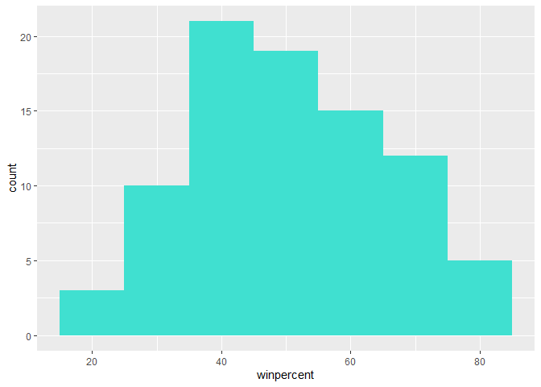
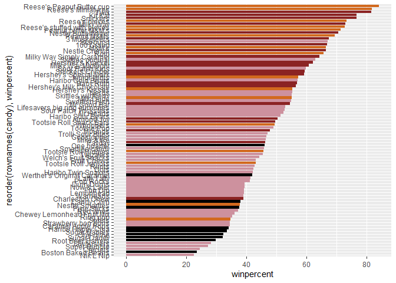
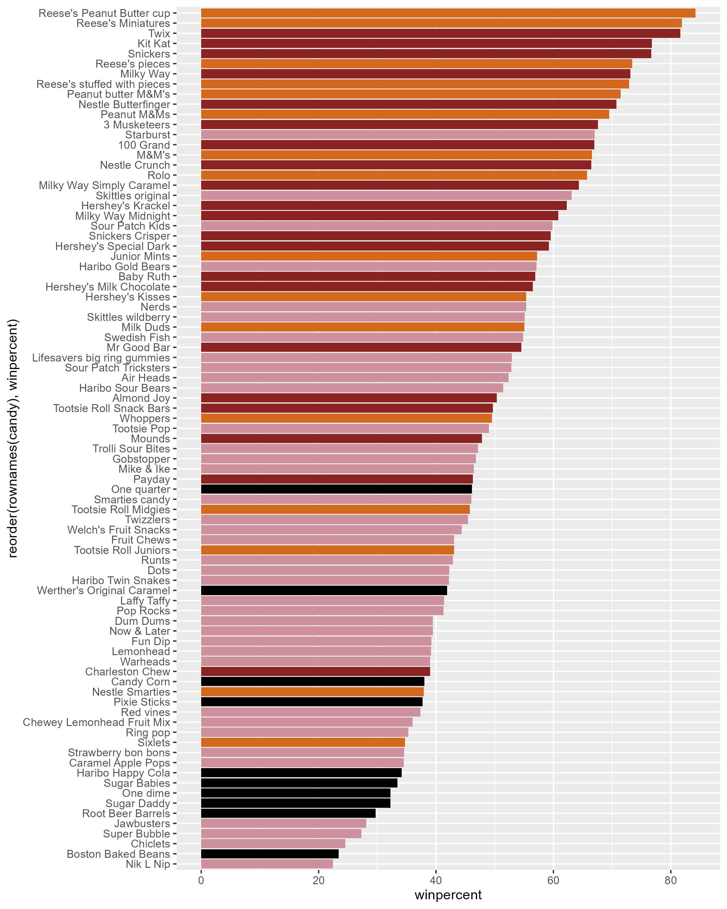
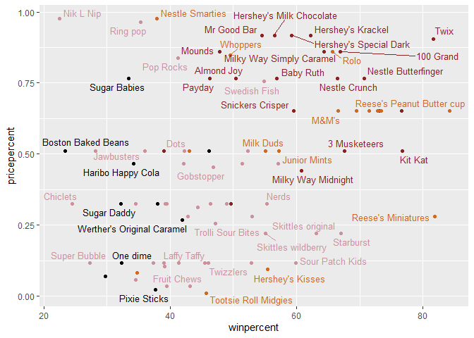
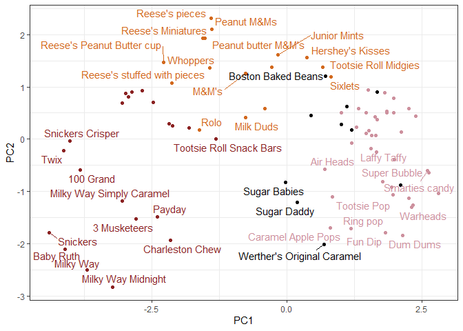
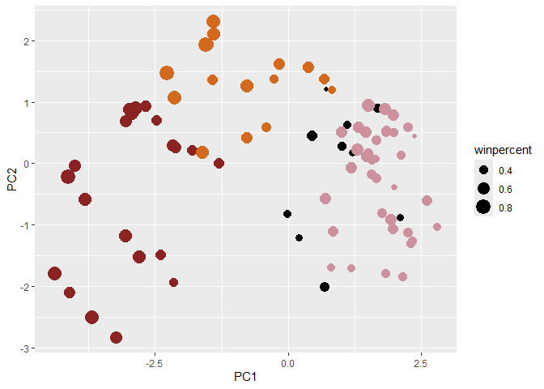
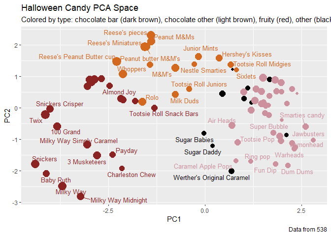
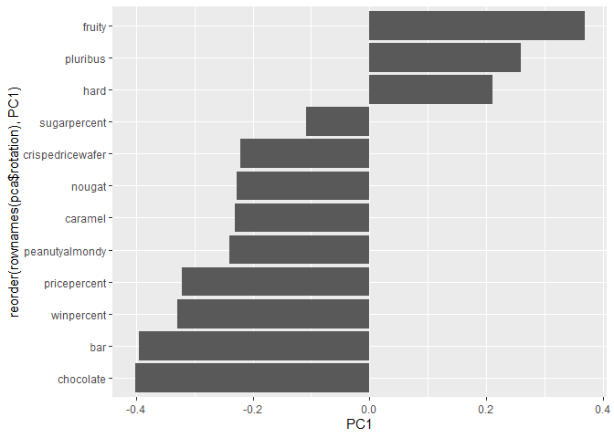

# Class 9: Halloween Mini-Project
Grace Wang (PID: A16968688

- [Data import](#data-import)
  - [Question 1](#question-1)
  - [Question 2](#question-2)
  - [Question 3](#question-3)
  - [Question 4](#question-4)
  - [Question 5](#question-5)
- [Exploratory analysis](#exploratory-analysis)
  - [Question 6](#question-6)
  - [Question 7](#question-7)
  - [Question 8](#question-8)
  - [Question 9](#question-9)
  - [Question 10](#question-10)
  - [Question 11](#question-11)
  - [Question 12](#question-12)
- [Overall rankings](#overall-rankings)
  - [Question 13](#question-13)
  - [Question 14](#question-14)
  - [Question 15](#question-15)
  - [Question 16](#question-16)
  - [Question 17](#question-17)
  - [Question 18](#question-18)
- [Pricepercent](#pricepercent)
  - [Question 19](#question-19)
  - [Question 20](#question-20)
- [Correlation structure](#correlation-structure)
  - [Question 22](#question-22)
  - [Question 23](#question-23)
- [PCA](#pca)
  - [Question 24](#question-24)

Today we will take a step back to some data we can taste to explore the
correlation structure and principal components or some Halloween candy.

## Data import

``` r
candy <- read.csv(url("https://raw.githubusercontent.com/fivethirtyeight/data/master/candy-power-ranking/candy-data.csv"), row.names = 1)
head(candy)
```

                 chocolate fruity caramel peanutyalmondy nougat crispedricewafer
    100 Grand            1      0       1              0      0                1
    3 Musketeers         1      0       0              0      1                0
    One dime             0      0       0              0      0                0
    One quarter          0      0       0              0      0                0
    Air Heads            0      1       0              0      0                0
    Almond Joy           1      0       0              1      0                0
                 hard bar pluribus sugarpercent pricepercent winpercent
    100 Grand       0   1        0        0.732        0.860   66.97173
    3 Musketeers    0   1        0        0.604        0.511   67.60294
    One dime        0   0        0        0.011        0.116   32.26109
    One quarter     0   0        0        0.011        0.511   46.11650
    Air Heads       0   0        0        0.906        0.511   52.34146
    Almond Joy      0   1        0        0.465        0.767   50.34755

### Question 1

How many different candy types are in this dataset?

``` r
nrow(candy)
```

    [1] 85

### Question 2

How many fruity candy types are in the dataset?

``` r
sum(candy$fruity)
```

    [1] 38

### Question 3

What is your favorite candy in the dataset and what is it’s `winpercent`
value?

M&M’s

``` r
candy["M&M's",]$winpercent
```

    [1] 66.57458

### Question 4

What is the `winpercent` value for “Kit Kat”?

``` r
candy["Kit Kat", ]$winpercent
```

    [1] 76.7686

### Question 5

What is the `winpercent` value for “Tootsie Roll Snack Bars”?

``` r
candy["Tootsie Roll Snack Bars", ]$winpercent
```

    [1] 49.6535

## Exploratory analysis

We can use the **skimr** package to get a quick overview of the dataset.
This can be useful for the first time you encounter a new dataset.

``` r
#install.packages("skimr")
```

``` r
skimr::skim(candy)
```

|                                                  |       |
|:-------------------------------------------------|:------|
| Name                                             | candy |
| Number of rows                                   | 85    |
| Number of columns                                | 12    |
| \_\_\_\_\_\_\_\_\_\_\_\_\_\_\_\_\_\_\_\_\_\_\_   |       |
| Column type frequency:                           |       |
| numeric                                          | 12    |
| \_\_\_\_\_\_\_\_\_\_\_\_\_\_\_\_\_\_\_\_\_\_\_\_ |       |
| Group variables                                  | None  |

Data summary

**Variable type: numeric**

| skim_variable | n_missing | complete_rate | mean | sd | p0 | p25 | p50 | p75 | p100 | hist |
|:---|---:|---:|---:|---:|---:|---:|---:|---:|---:|:---|
| chocolate | 0 | 1 | 0.44 | 0.50 | 0.00 | 0.00 | 0.00 | 1.00 | 1.00 | ▇▁▁▁▆ |
| fruity | 0 | 1 | 0.45 | 0.50 | 0.00 | 0.00 | 0.00 | 1.00 | 1.00 | ▇▁▁▁▆ |
| caramel | 0 | 1 | 0.16 | 0.37 | 0.00 | 0.00 | 0.00 | 0.00 | 1.00 | ▇▁▁▁▂ |
| peanutyalmondy | 0 | 1 | 0.16 | 0.37 | 0.00 | 0.00 | 0.00 | 0.00 | 1.00 | ▇▁▁▁▂ |
| nougat | 0 | 1 | 0.08 | 0.28 | 0.00 | 0.00 | 0.00 | 0.00 | 1.00 | ▇▁▁▁▁ |
| crispedricewafer | 0 | 1 | 0.08 | 0.28 | 0.00 | 0.00 | 0.00 | 0.00 | 1.00 | ▇▁▁▁▁ |
| hard | 0 | 1 | 0.18 | 0.38 | 0.00 | 0.00 | 0.00 | 0.00 | 1.00 | ▇▁▁▁▂ |
| bar | 0 | 1 | 0.25 | 0.43 | 0.00 | 0.00 | 0.00 | 0.00 | 1.00 | ▇▁▁▁▂ |
| pluribus | 0 | 1 | 0.52 | 0.50 | 0.00 | 0.00 | 1.00 | 1.00 | 1.00 | ▇▁▁▁▇ |
| sugarpercent | 0 | 1 | 0.48 | 0.28 | 0.01 | 0.22 | 0.47 | 0.73 | 0.99 | ▇▇▇▇▆ |
| pricepercent | 0 | 1 | 0.47 | 0.29 | 0.01 | 0.26 | 0.47 | 0.65 | 0.98 | ▇▇▇▇▆ |
| winpercent | 0 | 1 | 50.32 | 14.71 | 22.45 | 39.14 | 47.83 | 59.86 | 84.18 | ▃▇▆▅▂ |

### Question 6

Is there any variable/column that looks to be on a different scale to
the majority of the other columns in the dataset?

The `winpercent` column is on a different scale to the other columns.
Instead of being on a 0-1 scale like the other variables, `winpercent`
is on a 0-100 scale.

### Question 7

What do you think a zero and one represent for the `candy$chocolate`
column?

In the `candy$chocolate` column, a zero represents that the candy does
not have chocolate, and a one represents that it does.

### Question 8

Plot a histogram of `winpercent` values

``` r
hist(candy$winpercent)
```


``` r
library(ggplot2)
```

    Warning: package 'ggplot2' was built under R version 4.4.3

``` r
ggplot(candy) + 
  aes(winpercent) + 
  geom_histogram(binwidth = 10, fill = "turquoise")
```



### Question 9

Is the distribution of `winpercent`values symmetrical?

The distribution is skewed slightly to the right.

### Question 10

Is the center of the distribution above or below 50%?

``` r
summary(candy$winpercent)
```

       Min. 1st Qu.  Median    Mean 3rd Qu.    Max. 
      22.45   39.14   47.83   50.32   59.86   84.18 

The median of the data is below 50%, but the rightward skew pulls the
mean up to be greater than 50%.

### Question 11

On average is chocolate candy higher or lower ranked than fruit candy?

``` r
chocolate.win <- candy[candy$chocolate == 1, "winpercent"]
mean(chocolate.win)
```

    [1] 60.92153

``` r
fruity.win <- candy[candy$fruity == 1, "winpercent"]
mean(fruity.win)
```

    [1] 44.11974

On average, chocolate candy is higher ranked than fruity candy.

### Question 12

Is this difference statistically significant?

``` r
ans <- t.test(chocolate.win, fruity.win, paired = F, var.equal = F)
ans
```


        Welch Two Sample t-test

    data:  chocolate.win and fruity.win
    t = 6.2582, df = 68.882, p-value = 2.871e-08
    alternative hypothesis: true difference in means is not equal to 0
    95 percent confidence interval:
     11.44563 22.15795
    sample estimates:
    mean of x mean of y 
     60.92153  44.11974 

The difference is statistically significant with p-value 2.8713778^{-8}.

## Overall rankings

### Question 13

What are the five least liked candy types in this set?

There are two related functions that can help here: `sort()` and
`order()`.

``` r
x <- c(5, 10, 1, 4)
sort(x)
```

    [1]  1  4  5 10

``` r
order(x)
```

    [1] 3 4 1 2

``` r
inds <- order(candy$winpercent)
head(candy[inds,], n=5)
```

                       chocolate fruity caramel peanutyalmondy nougat
    Nik L Nip                  0      1       0              0      0
    Boston Baked Beans         0      0       0              1      0
    Chiclets                   0      1       0              0      0
    Super Bubble               0      1       0              0      0
    Jawbusters                 0      1       0              0      0
                       crispedricewafer hard bar pluribus sugarpercent pricepercent
    Nik L Nip                         0    0   0        1        0.197        0.976
    Boston Baked Beans                0    0   0        1        0.313        0.511
    Chiclets                          0    0   0        1        0.046        0.325
    Super Bubble                      0    0   0        0        0.162        0.116
    Jawbusters                        0    1   0        1        0.093        0.511
                       winpercent
    Nik L Nip            22.44534
    Boston Baked Beans   23.41782
    Chiclets             24.52499
    Super Bubble         27.30386
    Jawbusters           28.12744

The five least liked candies are Nik L Nip, Boston Baked Beans,
Chiclets, Superbubble and Jawbusters.

### Question 14

What are the top 5 all time favorite candy types out of this set?

``` r
tail(candy[inds,], n=5)
```

                              chocolate fruity caramel peanutyalmondy nougat
    Snickers                          1      0       1              1      1
    Kit Kat                           1      0       0              0      0
    Twix                              1      0       1              0      0
    Reese's Miniatures                1      0       0              1      0
    Reese's Peanut Butter cup         1      0       0              1      0
                              crispedricewafer hard bar pluribus sugarpercent
    Snickers                                 0    0   1        0        0.546
    Kit Kat                                  1    0   1        0        0.313
    Twix                                     1    0   1        0        0.546
    Reese's Miniatures                       0    0   0        0        0.034
    Reese's Peanut Butter cup                0    0   0        0        0.720
                              pricepercent winpercent
    Snickers                         0.651   76.67378
    Kit Kat                          0.511   76.76860
    Twix                             0.906   81.64291
    Reese's Miniatures               0.279   81.86626
    Reese's Peanut Butter cup        0.651   84.18029

The top 5 all-time favorite candy types are Reese’s Peanut Butter cups,
Reese’s Miniatures, Twix, Kit Kat, and Snickers.

Alternate

``` r
inds <- rev(inds)
head(candy[inds, ], n = 5)
```

                              chocolate fruity caramel peanutyalmondy nougat
    Reese's Peanut Butter cup         1      0       0              1      0
    Reese's Miniatures                1      0       0              1      0
    Twix                              1      0       1              0      0
    Kit Kat                           1      0       0              0      0
    Snickers                          1      0       1              1      1
                              crispedricewafer hard bar pluribus sugarpercent
    Reese's Peanut Butter cup                0    0   0        0        0.720
    Reese's Miniatures                       0    0   0        0        0.034
    Twix                                     1    0   1        0        0.546
    Kit Kat                                  1    0   1        0        0.313
    Snickers                                 0    0   1        0        0.546
                              pricepercent winpercent
    Reese's Peanut Butter cup        0.651   84.18029
    Reese's Miniatures               0.279   81.86626
    Twix                             0.906   81.64291
    Kit Kat                          0.511   76.76860
    Snickers                         0.651   76.67378

### Question 15

Make a first barplot of candy ranking based on `winpercent` values.

``` r
ggplot(candy) + 
  aes(winpercent, rownames(candy)) + 
  geom_col()
```


### Question 16

This is quite ugly, use the reorder() function to get the bars sorted by
`winpercent`?

``` r
ggplot(candy) + 
  aes(winpercent, reorder(rownames(candy), winpercent)) + 
  geom_col()
```


We want to create a custom color vector to color each bar based on the
type of candy - `chocolate` or `fruity`, as well as whether it is a
`bar`.

``` r
my_cols <- rep("black", nrow(candy))
my_cols[candy$chocolate == 1] <- "chocolate"
my_cols[candy$fruity == 1] <- "pink3"
my_cols[candy$bar == 1] <- "brown4"

ggplot(candy) + 
  aes(x = winpercent, 
      y = reorder(rownames(candy), winpercent)) + 
  geom_col(fill = my_cols)
```



``` r
ggsave("mybarplot.png", width = 8, height = 10)
```



### Question 17

What is the worst ranked chocolate candy?

The worst ranked chocolate candy is Sixlets.

### Question 18

What is the best ranked fruity candy?

The best ranked fruity candy is Starburst.

## Pricepercent

``` r
library(ggrepel)
```

    Warning: package 'ggrepel' was built under R version 4.4.3

``` r
ggplot(candy) +
  aes(winpercent, pricepercent, label=rownames(candy)) +
  geom_point(col=my_cols) + 
  geom_text_repel(col=my_cols, size=3.3, max.overlaps = 8)
```

    Warning: ggrepel: 33 unlabeled data points (too many overlaps). Consider
    increasing max.overlaps



### Question 19

Which candy type is the highest ranked in terms of `winpercent` for the
least money - i.e. offers the most bang for your buck?

Reese’s Miniatures offer the most bang for your buck.

### Question 20

What are the top 5 most expensive candy types in the dataset and of
these which is the least popular?

``` r
head(candy[order(candy$pricepercent, decreasing = T), ], n = 5)
```

                             chocolate fruity caramel peanutyalmondy nougat
    Nik L Nip                        0      1       0              0      0
    Nestle Smarties                  1      0       0              0      0
    Ring pop                         0      1       0              0      0
    Hershey's Krackel                1      0       0              0      0
    Hershey's Milk Chocolate         1      0       0              0      0
                             crispedricewafer hard bar pluribus sugarpercent
    Nik L Nip                               0    0   0        1        0.197
    Nestle Smarties                         0    0   0        1        0.267
    Ring pop                                0    1   0        0        0.732
    Hershey's Krackel                       1    0   1        0        0.430
    Hershey's Milk Chocolate                0    0   1        0        0.430
                             pricepercent winpercent
    Nik L Nip                       0.976   22.44534
    Nestle Smarties                 0.976   37.88719
    Ring pop                        0.965   35.29076
    Hershey's Krackel               0.918   62.28448
    Hershey's Milk Chocolate        0.918   56.49050

The 5 most expensive candy types in the dataset are Nik L Nip, Nestle
Smarties, Ring pops, Hershey’s Krackel, and Hershey’s Milk Chocolate. Of
these, Nik L Nip is least popular.

## Correlation structure

``` r
library(corrplot)
```

    Warning: package 'corrplot' was built under R version 4.4.3

    corrplot 0.95 loaded

``` r
cij <- cor(candy)
cij
```

                      chocolate      fruity     caramel peanutyalmondy      nougat
    chocolate         1.0000000 -0.74172106  0.24987535     0.37782357  0.25489183
    fruity           -0.7417211  1.00000000 -0.33548538    -0.39928014 -0.26936712
    caramel           0.2498753 -0.33548538  1.00000000     0.05935614  0.32849280
    peanutyalmondy    0.3778236 -0.39928014  0.05935614     1.00000000  0.21311310
    nougat            0.2548918 -0.26936712  0.32849280     0.21311310  1.00000000
    crispedricewafer  0.3412098 -0.26936712  0.21311310    -0.01764631 -0.08974359
    hard             -0.3441769  0.39067750 -0.12235513    -0.20555661 -0.13867505
    bar               0.5974211 -0.51506558  0.33396002     0.26041960  0.52297636
    pluribus         -0.3396752  0.29972522 -0.26958501    -0.20610932 -0.31033884
    sugarpercent      0.1041691 -0.03439296  0.22193335     0.08788927  0.12308135
    pricepercent      0.5046754 -0.43096853  0.25432709     0.30915323  0.15319643
    winpercent        0.6365167 -0.38093814  0.21341630     0.40619220  0.19937530
                     crispedricewafer        hard         bar    pluribus
    chocolate              0.34120978 -0.34417691  0.59742114 -0.33967519
    fruity                -0.26936712  0.39067750 -0.51506558  0.29972522
    caramel                0.21311310 -0.12235513  0.33396002 -0.26958501
    peanutyalmondy        -0.01764631 -0.20555661  0.26041960 -0.20610932
    nougat                -0.08974359 -0.13867505  0.52297636 -0.31033884
    crispedricewafer       1.00000000 -0.13867505  0.42375093 -0.22469338
    hard                  -0.13867505  1.00000000 -0.26516504  0.01453172
    bar                    0.42375093 -0.26516504  1.00000000 -0.59340892
    pluribus              -0.22469338  0.01453172 -0.59340892  1.00000000
    sugarpercent           0.06994969  0.09180975  0.09998516  0.04552282
    pricepercent           0.32826539 -0.24436534  0.51840654 -0.22079363
    winpercent             0.32467965 -0.31038158  0.42992933 -0.24744787
                     sugarpercent pricepercent winpercent
    chocolate          0.10416906    0.5046754  0.6365167
    fruity            -0.03439296   -0.4309685 -0.3809381
    caramel            0.22193335    0.2543271  0.2134163
    peanutyalmondy     0.08788927    0.3091532  0.4061922
    nougat             0.12308135    0.1531964  0.1993753
    crispedricewafer   0.06994969    0.3282654  0.3246797
    hard               0.09180975   -0.2443653 -0.3103816
    bar                0.09998516    0.5184065  0.4299293
    pluribus           0.04552282   -0.2207936 -0.2474479
    sugarpercent       1.00000000    0.3297064  0.2291507
    pricepercent       0.32970639    1.0000000  0.3453254
    winpercent         0.22915066    0.3453254  1.0000000

``` r
corrplot(cij)
```


### Question 22

Examining this plot what two variables are anti-correlated (i.e. have
minus values)?

The variables `chocolate` and `fruity` are most negatively correlated.

``` r
round(cij["chocolate", "fruity"], 2)
```

    [1] -0.74

### Question 23

Similarly, what two variables are most positively correlated?

The variables `chocolate` and `winpercent` are most positively
correlated.

``` r
round(cij["chocolate", "winpercent"], 2)
```

    [1] 0.64

## PCA

We need to be sure to scale our input `candy` dataset before PCA as we
have the `winpercent` column on a different scale to all the other
variables in the dataset.

``` r
pca <- prcomp(candy, scale = T)
summary(pca)
```

    Importance of components:
                              PC1    PC2    PC3     PC4    PC5     PC6     PC7
    Standard deviation     2.0788 1.1378 1.1092 1.07533 0.9518 0.81923 0.81530
    Proportion of Variance 0.3601 0.1079 0.1025 0.09636 0.0755 0.05593 0.05539
    Cumulative Proportion  0.3601 0.4680 0.5705 0.66688 0.7424 0.79830 0.85369
                               PC8     PC9    PC10    PC11    PC12
    Standard deviation     0.74530 0.67824 0.62349 0.43974 0.39760
    Proportion of Variance 0.04629 0.03833 0.03239 0.01611 0.01317
    Cumulative Proportion  0.89998 0.93832 0.97071 0.98683 1.00000

The first main result figure is the PCA plot.

``` r
ggplot(pca$x) + 
  aes(x = PC1, y = PC2, label = rownames(pca$x)) + 
  geom_point(col = my_cols) + 
  geom_text_repel(max.overlaps = 6, col = my_cols) + 
  theme_bw()
```

    Warning: ggrepel: 45 unlabeled data points (too many overlaps). Consider
    increasing max.overlaps



``` r
my_data <- cbind(candy, pca$x[,1:3])

p <- ggplot(my_data) + 
        aes(x=PC1, y=PC2, 
            size=winpercent/100,  
            text=rownames(my_data),
            label=rownames(my_data)) +
        geom_point(col=my_cols) + 
        labs(size = "winpercent")

p
```



``` r
p + geom_text_repel(size=3.3, col=my_cols, max.overlaps = 7)  + 
  theme(legend.position = "none") +
  labs(title="Halloween Candy PCA Space",
       subtitle="Colored by type: chocolate bar (dark brown), chocolate other (light brown), fruity (red), other (black)",
       caption="Data from 538")
```

    Warning: ggrepel: 43 unlabeled data points (too many overlaps). Consider
    increasing max.overlaps



``` r
#install.packages("plotly")
#library(plotly)
#ggplotly(p)
```

The second main PCA result is in `pca$rotation`, which we can use to
generate the loadings plot.

``` r
par(mar=c(8,4,2,2))
barplot(pca$rotation[,1], las=2, ylab="PC1 Contribution")
```


``` r
pca$rotation
```

                            PC1         PC2         PC3          PC4          PC5
    chocolate        -0.4019466  0.21404160  0.01601358 -0.016673032  0.066035846
    fruity            0.3683883 -0.18304666 -0.13765612 -0.004479829  0.143535325
    caramel          -0.2299709 -0.40349894 -0.13294166 -0.024889542 -0.507301501
    peanutyalmondy   -0.2407155  0.22446919  0.18272802  0.466784287  0.399930245
    nougat           -0.2268102 -0.47016599  0.33970244  0.299581403 -0.188852418
    crispedricewafer -0.2215182  0.09719527 -0.36485542 -0.605594730  0.034652316
    hard              0.2111587 -0.43262603 -0.20295368 -0.032249660  0.574557816
    bar              -0.3947433 -0.22255618  0.10696092 -0.186914549  0.077794806
    pluribus          0.2600041  0.36920922 -0.26813772  0.287246604 -0.392796479
    sugarpercent     -0.1083088 -0.23647379 -0.65509692  0.433896248  0.007469103
    pricepercent     -0.3207361  0.05883628 -0.33048843  0.063557149  0.043358887
    winpercent       -0.3298035  0.21115347 -0.13531766  0.117930997  0.168755073
                             PC6         PC7         PC8          PC9         PC10
    chocolate        -0.09018950 -0.08360642 -0.49084856 -0.151651568  0.107661356
    fruity           -0.04266105  0.46147889  0.39805802 -0.001248306  0.362062502
    caramel          -0.40346502 -0.44274741  0.26963447  0.019186442  0.229799010
    peanutyalmondy   -0.09416259 -0.25710489  0.45771445  0.381068550 -0.145912362
    nougat            0.09012643  0.36663902 -0.18793955  0.385278987  0.011323453
    crispedricewafer -0.09007640  0.13077042  0.13567736  0.511634999 -0.264810144
    hard             -0.12767365 -0.31933477 -0.38881683  0.258154433  0.220779142
    bar               0.25307332  0.24192992 -0.02982691  0.091872886 -0.003232321
    pluribus          0.03184932  0.04066352 -0.28652547  0.529954405  0.199303452
    sugarpercent      0.02737834  0.14721840 -0.04114076 -0.217685759 -0.488103337
    pricepercent      0.62908570 -0.14308215  0.16722078 -0.048991557  0.507716043
    winpercent       -0.56947283  0.40260385 -0.02936405 -0.124440117  0.358431235
                            PC11        PC12
    chocolate         0.10045278  0.69784924
    fruity            0.17494902  0.50624242
    caramel           0.13515820  0.07548984
    peanutyalmondy    0.11244275  0.12972756
    nougat           -0.38954473  0.09223698
    crispedricewafer -0.22615618  0.11727369
    hard              0.01342330 -0.10430092
    bar               0.74956878 -0.22010569
    pluribus          0.27971527 -0.06169246
    sugarpercent      0.05373286  0.04733985
    pricepercent     -0.26396582 -0.06698291
    winpercent       -0.11251626 -0.37693153

``` r
ggplot(pca$rotation) + 
  aes(PC1, reorder(rownames(pca$rotation), PC1)) + 
  geom_col()
```



### Question 24

What original variables are picked up strongly by PC1 in the positive
direction? Do these make sense to you?

The variables `fruity`, `pluribus`, and `hard` are picked up strongly by
PC1 in the positive direction. These make sense because they are
positively correlated with each other and tend to be negatively
correlated with the rest of the variables.
