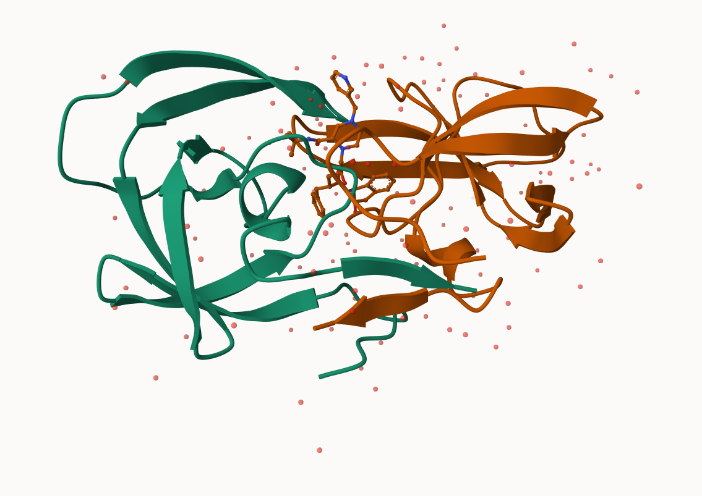

# Class 10: Structural Bioinformatics (pt 1)
Grace Wang (PID: A16968688)

- [The PDB database](#the-pdb-database)
  - [Question 1](#question-1)
  - [Question 2](#question-2)
  - [Question 3](#question-3)
- [Visualizing with Mol-star](#visualizing-with-mol-star)
- [Using the `bio3d` package in R](#using-the-bio3d-package-in-r)
- [Molecular visualization in R](#molecular-visualization-in-r)
- [Predicting functional motions of a
  structure](#predicting-functional-motions-of-a-structure)

## The PDB database

The main repository of biomolecular structure data is called the
[Protein Data Bank](https://www.rcsb.org) (PDB). It is the second oldest
database (after GenBank).

What is currently in the PDB?

``` r
stats <- read.csv("Data Export Summary.csv", row.names = 1)
head(stats)
```

                              X.ray     EM    NMR Multiple.methods Neutron Other
    Protein (only)          171,959 18,083 12,622              210      84    32
    Protein/Oligosaccharide  10,018  2,968     34               10       2     0
    Protein/NA                8,847  5,376    286                7       0     0
    Nucleic acid (only)       2,947    185  1,535               14       3     1
    Other                       170     10     33                0       0     0
    Oligosaccharide (only)       11      0      6                1       0     4
                              Total
    Protein (only)          202,990
    Protein/Oligosaccharide  13,032
    Protein/NA               14,516
    Nucleic acid (only)       4,685
    Other                       213
    Oligosaccharide (only)       22

### Question 1

What percentage of structures in the PDB are solved by X-Ray and
Electron Microscopy?

``` r
del_comma <- function(x){
  as.numeric(gsub(",", "", x))
}

stats <- data.frame(apply(stats, 2, del_comma), row.names = rownames(stats))
```

``` r
sum(stats$X.ray) / sum(stats$Total) * 100
```

    [1] 82.37223

``` r
sum(stats$EM) / sum(stats$Total) * 100
```

    [1] 11.30648

### Question 2

What proportion of structures in the PDB are protein?

``` r
sum(stats["Protein (only)", -ncol(stats)]) / sum(stats$Total) * 100
```

    [1] 86.2107

### Question 3

Type HIV in the PDB website search box on the home page and determine
how many HIV-1 protease structures are in the current PDB?

Skipped

## Visualizing with Mol-star

Explore the HIV-1 protease structure with PDB code `1HSG`.

We will use [Mol-star](https://molstar.org/viewer).




## Using the `bio3d` package in R

The Bio3D package is focused on structural bioinformatics analysis and
allows us to read and analyze PDB (and related) datasets.

``` r
library(bio3d)
```

    Warning: package 'bio3d' was built under R version 4.4.3

``` r
pdb <- read.pdb("1HSG")
```

      Note: Accessing on-line PDB file

``` r
pdb
```


     Call:  read.pdb(file = "1HSG")

       Total Models#: 1
         Total Atoms#: 1686,  XYZs#: 5058  Chains#: 2  (values: A B)

         Protein Atoms#: 1514  (residues/Calpha atoms#: 198)
         Nucleic acid Atoms#: 0  (residues/phosphate atoms#: 0)

         Non-protein/nucleic Atoms#: 172  (residues: 128)
         Non-protein/nucleic resid values: [ HOH (127), MK1 (1) ]

       Protein sequence:
          PQITLWQRPLVTIKIGGQLKEALLDTGADDTVLEEMSLPGRWKPKMIGGIGGFIKVRQYD
          QILIEICGHKAIGTVLVGPTPVNIIGRNLLTQIGCTLNFPQITLWQRPLVTIKIGGQLKE
          ALLDTGADDTVLEEMSLPGRWKPKMIGGIGGFIKVRQYDQILIEICGHKAIGTVLVGPTP
          VNIIGRNLLTQIGCTLNF

    + attr: atom, xyz, seqres, helix, sheet,
            calpha, remark, call

``` r
attributes(pdb)
```

    $names
    [1] "atom"   "xyz"    "seqres" "helix"  "sheet"  "calpha" "remark" "call"  

    $class
    [1] "pdb" "sse"

We can see atom data with `pdb$atom`.

``` r
head(pdb$atom)
```

      type eleno elety  alt resid chain resno insert      x      y     z o     b
    1 ATOM     1     N <NA>   PRO     A     1   <NA> 29.361 39.686 5.862 1 38.10
    2 ATOM     2    CA <NA>   PRO     A     1   <NA> 30.307 38.663 5.319 1 40.62
    3 ATOM     3     C <NA>   PRO     A     1   <NA> 29.760 38.071 4.022 1 42.64
    4 ATOM     4     O <NA>   PRO     A     1   <NA> 28.600 38.302 3.676 1 43.40
    5 ATOM     5    CB <NA>   PRO     A     1   <NA> 30.508 37.541 6.342 1 37.87
    6 ATOM     6    CG <NA>   PRO     A     1   <NA> 29.296 37.591 7.162 1 38.40
      segid elesy charge
    1  <NA>     N   <NA>
    2  <NA>     C   <NA>
    3  <NA>     C   <NA>
    4  <NA>     O   <NA>
    5  <NA>     C   <NA>
    6  <NA>     C   <NA>

``` r
head(pdbseq(pdb))
```

      1   2   3   4   5   6 
    "P" "Q" "I" "T" "L" "W" 

## Molecular visualization in R

We can make a quick 3d visualization with the `view.pdb()` function.

``` r
#install.packages("pak")
#pak::pak("bioboot/bio3dview")
library(bio3dview)

#install.packages("NGLVieweR")
library(NGLVieweR)
```

    Warning: package 'NGLVieweR' was built under R version 4.4.3

``` r
# view.pdb(pdb, backgroundColor = "cyan", colorScheme = "sse") |>
#  setSpin()
```

``` r
sel <- atom.select(pdb, resno = 25)

# view.pdb(pdb, 
#          highlight = sel, 
#          highlight.style = "spacefill", 
#          cols = c("green", "orange")) |> 
#   setRock()
```

## Predicting functional motions of a structure

We can finish off with a bioinformatics prediction of the functional
motions of a protein.

We will run a Normal Mode Analysis (NMA).

``` r
adk <- read.pdb("6s36")
```

      Note: Accessing on-line PDB file
       PDB has ALT records, taking A only, rm.alt=TRUE

``` r
adk
```


     Call:  read.pdb(file = "6s36")

       Total Models#: 1
         Total Atoms#: 1898,  XYZs#: 5694  Chains#: 1  (values: A)

         Protein Atoms#: 1654  (residues/Calpha atoms#: 214)
         Nucleic acid Atoms#: 0  (residues/phosphate atoms#: 0)

         Non-protein/nucleic Atoms#: 244  (residues: 244)
         Non-protein/nucleic resid values: [ CL (3), HOH (238), MG (2), NA (1) ]

       Protein sequence:
          MRIILLGAPGAGKGTQAQFIMEKYGIPQISTGDMLRAAVKSGSELGKQAKDIMDAGKLVT
          DELVIALVKERIAQEDCRNGFLLDGFPRTIPQADAMKEAGINVDYVLEFDVPDELIVDKI
          VGRRVHAPSGRVYHVKFNPPKVEGKDDVTGEELTTRKDDQEETVRKRLVEYHQMTAPLIG
          YYSKEAEAGNTKYAKVDGTKPVAEVRADLEKILG

    + attr: atom, xyz, seqres, helix, sheet,
            calpha, remark, call

``` r
m <- nma(adk)
```

     Building Hessian...        Done in 0.03 seconds.
     Diagonalizing Hessian...   Done in 0.41 seconds.

``` r
plot(m)
```


``` r
# view.nma(m)
```

We can write out a trajectory of the predicted dynamics and view this in
Mol-star.

``` r
mktrj(m, file = "nma.pdb")
```
