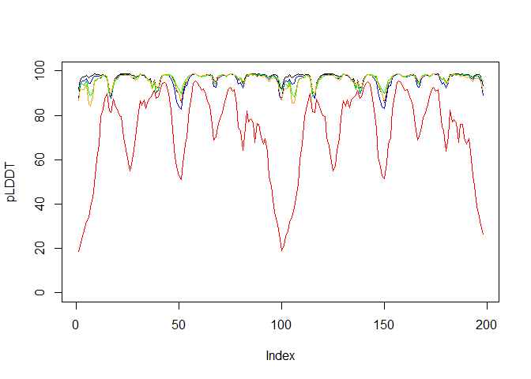
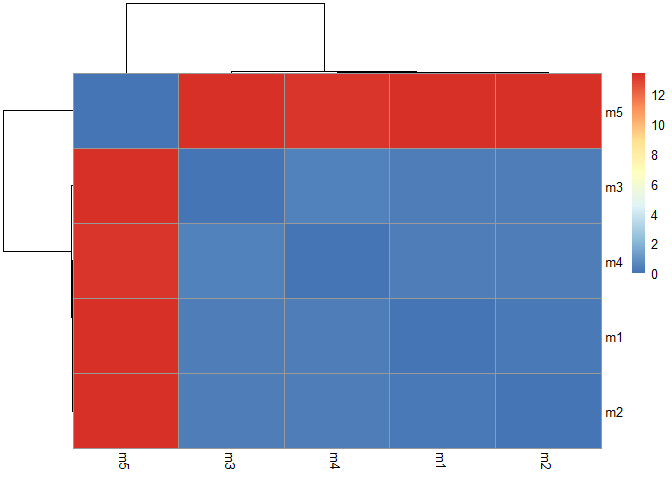
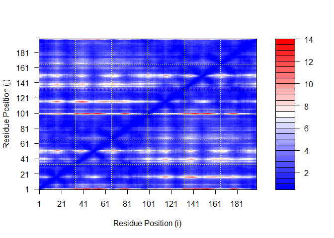
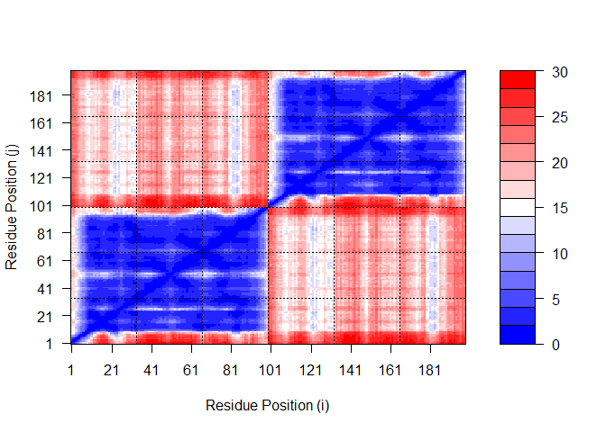
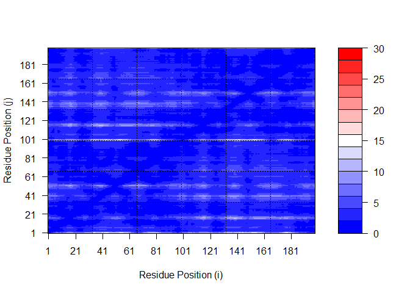
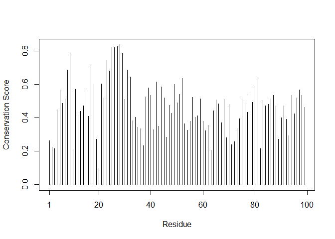
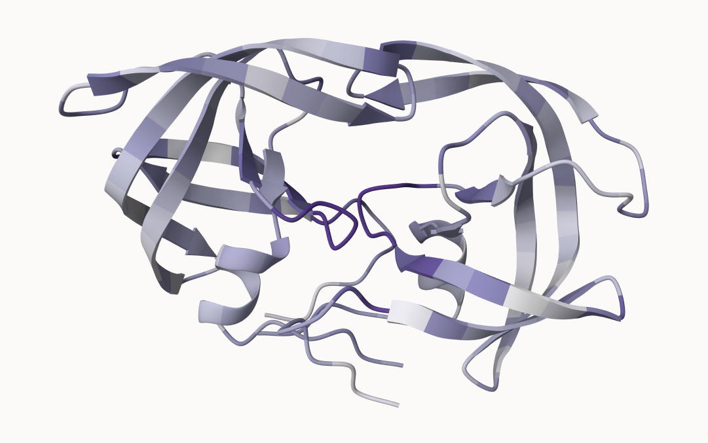

# Class 11: AlphaFold
Grace Wang (PID: A16968688)

- [PAE](#pae)
- [Residue conservation](#residue-conservation)

Here we read the results from AlphaFold and try to interpret the models
and quality score metrics.

``` r
library(bio3d)
```

    Warning: package 'bio3d' was built under R version 4.4.3

``` r
library(bio3dview)
library(msa)
```

    Loading required package: Biostrings

    Loading required package: BiocGenerics


    Attaching package: 'BiocGenerics'

    The following objects are masked from 'package:stats':

        IQR, mad, sd, var, xtabs

    The following objects are masked from 'package:base':

        anyDuplicated, aperm, append, as.data.frame, basename, cbind,
        colnames, dirname, do.call, duplicated, eval, evalq, Filter, Find,
        get, grep, grepl, intersect, is.unsorted, lapply, Map, mapply,
        match, mget, order, paste, pmax, pmax.int, pmin, pmin.int,
        Position, rank, rbind, Reduce, rownames, sapply, saveRDS, setdiff,
        table, tapply, union, unique, unsplit, which.max, which.min

    Loading required package: S4Vectors

    Loading required package: stats4


    Attaching package: 'S4Vectors'

    The following object is masked from 'package:utils':

        findMatches

    The following objects are masked from 'package:base':

        expand.grid, I, unname

    Loading required package: IRanges


    Attaching package: 'IRanges'

    The following object is masked from 'package:bio3d':

        trim

    The following object is masked from 'package:grDevices':

        windows

    Loading required package: XVector

    Loading required package: GenomeInfoDb


    Attaching package: 'Biostrings'

    The following object is masked from 'package:bio3d':

        mask

    The following object is masked from 'package:base':

        strsplit

``` r
pth <- "hivprdimer_23119/"
pdb.files <- list.files(path = pth, full.names = T, pattern = ".pdb")
```

Align and superimpose all the models.

``` r
file.exists(pdb.files)
```

    [1] TRUE TRUE TRUE TRUE TRUE

``` r
pdbs <- pdbaln(pdb.files, fit = TRUE, exefile = "msa")
```

    Reading PDB files:
    hivprdimer_23119/hivprdimer_23119_unrelaxed_rank_001_alphafold2_multimer_v3_model_2_seed_000.pdb
    hivprdimer_23119/hivprdimer_23119_unrelaxed_rank_002_alphafold2_multimer_v3_model_5_seed_000.pdb
    hivprdimer_23119/hivprdimer_23119_unrelaxed_rank_003_alphafold2_multimer_v3_model_4_seed_000.pdb
    hivprdimer_23119/hivprdimer_23119_unrelaxed_rank_004_alphafold2_multimer_v3_model_1_seed_000.pdb
    hivprdimer_23119/hivprdimer_23119_unrelaxed_rank_005_alphafold2_multimer_v3_model_3_seed_000.pdb
    .....

    Extracting sequences

    pdb/seq: 1   name: hivprdimer_23119/hivprdimer_23119_unrelaxed_rank_001_alphafold2_multimer_v3_model_2_seed_000.pdb 
    pdb/seq: 2   name: hivprdimer_23119/hivprdimer_23119_unrelaxed_rank_002_alphafold2_multimer_v3_model_5_seed_000.pdb 
    pdb/seq: 3   name: hivprdimer_23119/hivprdimer_23119_unrelaxed_rank_003_alphafold2_multimer_v3_model_4_seed_000.pdb 
    pdb/seq: 4   name: hivprdimer_23119/hivprdimer_23119_unrelaxed_rank_004_alphafold2_multimer_v3_model_1_seed_000.pdb 
    pdb/seq: 5   name: hivprdimer_23119/hivprdimer_23119_unrelaxed_rank_005_alphafold2_multimer_v3_model_3_seed_000.pdb 

``` r
#view.pdbs(pdbs)
```

``` r
plot(pdbs$b[1, ], typ = "l", ylim = c(0, 100), ylab = "pLDDT")
lines(pdbs$b[2, ], type = "l", col = "blue")
lines(pdbs$b[3, ], type = "l", col = "green")
lines(pdbs$b[4, ], type = "l", col = "orange")
lines(pdbs$b[5, ], type = "l", col = "red")
```



``` r
#install.packages("pheatmap")
library(pheatmap)
```

    Warning: package 'pheatmap' was built under R version 4.4.3

``` r
rd <- rmsd(pdbs)
```

    Warning in rmsd(pdbs): No indices provided, using the 198 non NA positions

``` r
colnames(rd) <- paste0("m",1:5)
rownames(rd) <- paste0("m",1:5)
pheatmap(rd)
```



### PAE

``` r
#install.packages("jsonlite")
library(jsonlite)
```

    Warning: package 'jsonlite' was built under R version 4.4.3

``` r
pae_files <- list.files(path = pth,
                        pattern = ".*model.*\\.json",
                        full.names = TRUE)
```

``` r
pae1 <- read_json(pae_files[1],simplifyVector = TRUE)
pae2 <- read_json(pae_files[2],simplifyVector = TRUE)
pae3 <- read_json(pae_files[3],simplifyVector = TRUE)
pae4 <- read_json(pae_files[4],simplifyVector = TRUE)
pae5 <- read_json(pae_files[5],simplifyVector = TRUE)

attributes(pae1)
```

    $names
    [1] "plddt"   "max_pae" "pae"     "ptm"     "iptm"   

``` r
head(pae1$plddt)
```

    [1] 91.44 96.06 97.38 97.38 98.19 96.94

``` r
pae1$max_pae
```

    [1] 13.57812

``` r
pae2$max_pae
```

    [1] 15.71094

``` r
pae3$max_pae
```

    [1] 12.41406

``` r
pae4$max_pae
```

    [1] 19.95312

``` r
pae5$max_pae
```

    [1] 29.85938

``` r
plot.dmat(pae1$pae, 
          xlab="Residue Position (i)",
          ylab="Residue Position (j)")
```



``` r
plot.dmat(pae5$pae, 
          xlab="Residue Position (i)",
          ylab="Residue Position (j)",
          grid.col = "black",
          zlim=c(0,30))
```



``` r
plot.dmat(pae1$pae, 
          xlab="Residue Position (i)",
          ylab="Residue Position (j)",
          grid.col = "black",
          zlim=c(0,30))
```



### Residue conservation

``` r
aln_file <- list.files(path = pth,
                       pattern = ".a3m$",
                        full.names = TRUE)
aln_file
```

    [1] "hivprdimer_23119/hivprdimer_23119.a3m"

``` r
aln <- read.fasta(aln_file[1], to.upper = TRUE)
```

    [1] " ** Duplicated sequence id's: 101 **"
    [2] " ** Duplicated sequence id's: 101 **"

``` r
dim(aln$ali)
```

    [1] 5378  132

``` r
sim <- conserv(aln)

pdb <- read.pdb("1ake")
```

      Note: Accessing on-line PDB file
       PDB has ALT records, taking A only, rm.alt=TRUE

``` r
plotb3(sim[1:99], sse=trim.pdb(pdb, chain="A"),
       ylab="Conservation Score")
```

    Warning in plotb3(sim[1:99], sse = trim.pdb(pdb, chain = "A"), ylab =
    "Conservation Score"): Length of input 'sse' does not equal the length of input
    'x'; Ignoring 'sse'



``` r
con <- consensus(aln, cutoff = 0.9)
con$seq
```

      [1] "-" "-" "-" "-" "-" "-" "-" "-" "-" "-" "-" "-" "-" "-" "-" "-" "-" "-"
     [19] "-" "-" "-" "-" "-" "-" "D" "T" "G" "A" "-" "-" "-" "-" "-" "-" "-" "-"
     [37] "-" "-" "-" "-" "-" "-" "-" "-" "-" "-" "-" "-" "-" "-" "-" "-" "-" "-"
     [55] "-" "-" "-" "-" "-" "-" "-" "-" "-" "-" "-" "-" "-" "-" "-" "-" "-" "-"
     [73] "-" "-" "-" "-" "-" "-" "-" "-" "-" "-" "-" "-" "-" "-" "-" "-" "-" "-"
     [91] "-" "-" "-" "-" "-" "-" "-" "-" "-" "-" "-" "-" "-" "-" "-" "-" "-" "-"
    [109] "-" "-" "-" "-" "-" "-" "-" "-" "-" "-" "-" "-" "-" "-" "-" "-" "-" "-"
    [127] "-" "-" "-" "-" "-" "-"

``` r
m1.pdb <- read.pdb(pdb.files[1])
occ <- vec2resno(c(sim[1:99], sim[1:99]), m1.pdb$atom$resno)
write.pdb(m1.pdb, o=occ, file="m1_conserv.pdb")
```



Homework: PAE plot, sequence conservation plot for find-a-gene project
(q9)
