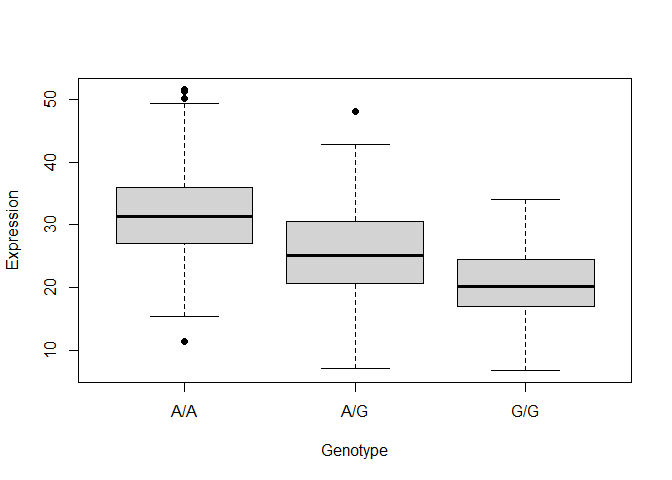
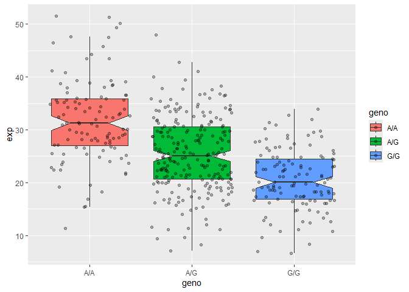

# Class 12: RNASeq Population Analysis
Grace Wang (PID: A16968688)

## Question 13

Read this file into R and determine the sample size for each genotype
and their corresponding median expression levels for each of these
genotypes.

Hint: The read.table(), summary() and boxplot() functions will likely be
useful here. There is an example R script online to be used ONLY if you
are struggling in vein. Note that you can find the medium value from
saving the output of the boxplot() function to an R object and examining
this object. There is also the medium() and summary() function that you
can use to check your understanding.

``` r
expr <- read.csv("rs8067378_ENSG00000172057.6.txt", sep = "")

table(expr$geno)
```


    A/A A/G G/G 
    108 233 121 

``` r
box <- boxplot(expr$exp ~ expr$geno, 
        pch = 19, 
        xlab = "Genotype", 
        ylab = "Expression")
```



``` r
attributes(box)
```

    $names
    [1] "stats" "n"     "conf"  "out"   "group" "names"

``` r
box$stats[3, ]
```

    [1] 31.24847 25.06486 20.07363

Using dplyr to make sure I remember how

``` r
library(dplyr)
```

``` r
expr_med <- expr %>% group_by(geno) %>% summarize(median = median(exp))
expr_med
```

    # A tibble: 3 × 2
      geno  median
      <chr>  <dbl>
    1 A/A     31.2
    2 A/G     25.1
    3 G/G     20.1

## Question 14

Generate a boxplot with a box per genotype, what could you infer from
the relative expression value between A/A and G/G displayed in this
plot? Does the SNP effect the expression of ORMDL3?

Hint: An example boxplot is provided overleaf – yours does not need to
be as polished as this one.

``` r
library(ggplot2)
```

    Warning: package 'ggplot2' was built under R version 4.4.3

``` r
ggplot(expr) + 
  aes(x = geno, y = exp, fill = geno) + 
  geom_boxplot(notch = T, outliers = F) + 
  geom_point(position = "jitter", alpha = .3)
```



The SNP seems to have an effect on the expression of ORMDL3, as the G/G
genotype has lower expression than does the A/A genotype.
