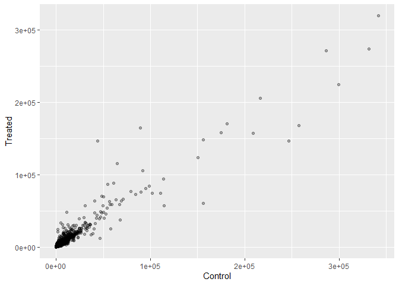
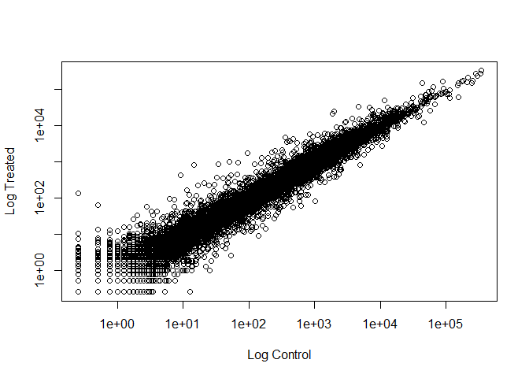
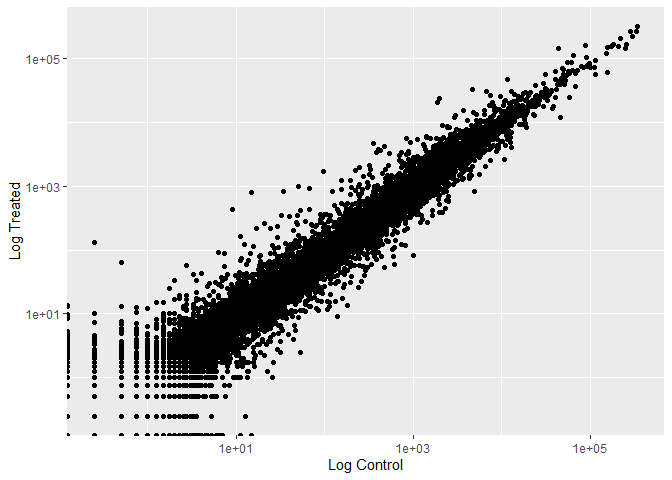
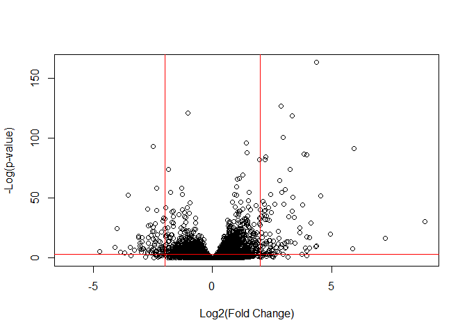
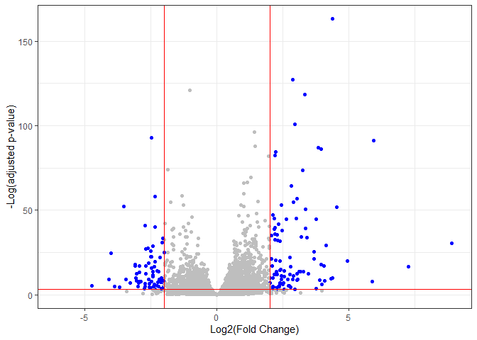

# Class 13: RNASeq Analysis
Grace Wang (PID: A16968688)

- [Background](#background)
- [Toy differential gene expression](#toy-differential-gene-expression)
- [DESeq2 analysis](#deseq2-analysis)
- [Result figure: Volcano plot](#result-figure-volcano-plot)
- [Gene annotations](#gene-annotations)
- [Pathway analysis](#pathway-analysis)

# Background

Today we will analyze some RNA sequencing data on the effects of a
common steroid drug (dexamethasone) on airway cell lines.

There are two main inputs we need for this analysis:

- `countData` - counts with genes in rows and experiments in columns
- `colData` - metadata that tells us about the design of the experiment
  (i.e., what is in the columns of `countData`)

``` r
library(tidyverse)
```

``` r
counts <- read.csv("airway_scaledcounts.csv", row.names = 1)
metadata <- read.csv("airway_metadata.csv")
```

``` r
head(counts)
```

                    SRR1039508 SRR1039509 SRR1039512 SRR1039513 SRR1039516
    ENSG00000000003        723        486        904        445       1170
    ENSG00000000005          0          0          0          0          0
    ENSG00000000419        467        523        616        371        582
    ENSG00000000457        347        258        364        237        318
    ENSG00000000460         96         81         73         66        118
    ENSG00000000938          0          0          1          0          2
                    SRR1039517 SRR1039520 SRR1039521
    ENSG00000000003       1097        806        604
    ENSG00000000005          0          0          0
    ENSG00000000419        781        417        509
    ENSG00000000457        447        330        324
    ENSG00000000460         94        102         74
    ENSG00000000938          0          0          0

``` r
head(metadata)
```

              id     dex celltype     geo_id
    1 SRR1039508 control   N61311 GSM1275862
    2 SRR1039509 treated   N61311 GSM1275863
    3 SRR1039512 control  N052611 GSM1275866
    4 SRR1039513 treated  N052611 GSM1275867
    5 SRR1039516 control  N080611 GSM1275870
    6 SRR1039517 treated  N080611 GSM1275871

> Q1: How many genes are in this dataset?

``` r
nrow(counts)
```

    [1] 38694

> Q2: How many ‘control’ cell lines do we have?

``` r
nrow(metadata[metadata$dex == "control", ])
```

    [1] 4

# Toy differential gene expression

Let’s try finding the mean of the `control` and `treated` columns and
see if they differ.

The \$dex column tells us whether we have `control` or `treated`

``` r
control <- metadata %>% filter(dex == "control")
```

Extract the `control` values for each gene

``` r
control_counts <- counts[, control$id]
```

Calculate the `mean()` for each gene’s `control` value

``` r
control_means <- rowMeans(control_counts)
head(control_means)
```

    ENSG00000000003 ENSG00000000005 ENSG00000000419 ENSG00000000457 ENSG00000000460 
             900.75            0.00          520.50          339.75           97.25 
    ENSG00000000938 
               0.75 

> Q3: Do the same for `treated` to get `treated_means`

``` r
treated <- metadata %>% filter(dex == "treated")
treated_counts <- counts[, treated$id]
treated_means <- rowMeans(treated_counts)
head(treated_means)
```

    ENSG00000000003 ENSG00000000005 ENSG00000000419 ENSG00000000457 ENSG00000000460 
             658.00            0.00          546.00          316.50           78.75 
    ENSG00000000938 
               0.00 

> Q4: Make a plot of `control_means` vs `treated_means`

Let’s store our mean values together in a dataframe for easier
bookkeeping

``` r
meancounts <- data.frame(control_means, treated_means)
```

``` r
ggplot(meancounts) + 
  aes(x = control_means, y = treated_means) + 
  geom_point(alpha = 0.3) + 
  labs(x = "Control", y = "Treated")
```



We need to log transform the data as it is heavily skewed

``` r
plot(meancounts, log = "xy", xlab = "Log Control", ylab = "Log Treated")
```

    Warning in xy.coords(x, y, xlabel, ylabel, log): 15032 x values <= 0 omitted
    from logarithmic plot

    Warning in xy.coords(x, y, xlabel, ylabel, log): 15281 y values <= 0 omitted
    from logarithmic plot



``` r
ggplot(meancounts) + 
  aes(x = control_means, y = treated_means) + 
  geom_point() + 
  scale_x_log10() + 
  scale_y_log10() + 
  labs(x = "Log Control", y = "Log Treated")
```

    Warning in scale_x_log10(): log-10 transformation introduced infinite values.

    Warning in scale_y_log10(): log-10 transformation introduced infinite values.



Log2-fold changes:

- Same amount: 0
- Doubling: 1
- Halving: -1

A common rule-of-thumb is to focus on genes with a log2 “fold-change” of
+2 as so-called up-regulated and -2 as down-regulated

Let’s acd a log2 fold-change value to our `meancounts` dataframe

``` r
meancounts$log2fc <- log2(meancounts$treated_means / meancounts$control_means)
head(meancounts)
```

                    control_means treated_means      log2fc
    ENSG00000000003        900.75        658.00 -0.45303916
    ENSG00000000005          0.00          0.00         NaN
    ENSG00000000419        520.50        546.00  0.06900279
    ENSG00000000457        339.75        316.50 -0.10226805
    ENSG00000000460         97.25         78.75 -0.30441833
    ENSG00000000938          0.75          0.00        -Inf

We need to exclude the genes for which expression in either `control` or
`treated` is 0.

> Q5: Remove any “zero count” genes from the dataset for further
> analysis.

``` r
to.keep <- rowSums(meancounts[, 1:2] == 0) == 0
sum(to.keep)
```

    [1] 21817

``` r
mycounts <- meancounts[to.keep, ]
head(mycounts)
```

                    control_means treated_means      log2fc
    ENSG00000000003        900.75        658.00 -0.45303916
    ENSG00000000419        520.50        546.00  0.06900279
    ENSG00000000457        339.75        316.50 -0.10226805
    ENSG00000000460         97.25         78.75 -0.30441833
    ENSG00000000971       5219.00       6687.50  0.35769358
    ENSG00000001036       2327.00       1785.75 -0.38194109

> Q6: How many genes are “up-regulated” at a log2fc threshold of +2?

``` r
up.ind <- which(mycounts$log2fc >= 2)
length(up.ind)
```

    [1] 314

> Q7: How many genes are “down-regulated” at a log2fc threshold of -2?

``` r
down.ind <- which(mycounts$log2fc <= -2)
length(down.ind)
```

    [1] 485

We are missing statistics - we can’t fully trust these results.

# DESeq2 analysis

Let’s do this properly and consider the stats - are the differences in
the means significant?

We will use DESeq2.

``` r
library(DESeq2)
```

The first function we will use from this package sets up the input in
the particular format that DESeq wants.

``` r
dds <- DESeqDataSetFromMatrix(countData = counts,
                       colData = metadata, 
                       design = ~dex)
```

    converting counts to integer mode

    Warning in DESeqDataSet(se, design = design, ignoreRank): some variables in
    design formula are characters, converting to factors

We can now run our DESeq analysis.

``` r
dds <- DESeq(dds)
```

    estimating size factors

    estimating dispersions

    gene-wise dispersion estimates

    mean-dispersion relationship

    final dispersion estimates

    fitting model and testing

``` r
res <- results(dds)
head(res)
```

    log2 fold change (MLE): dex treated vs control 
    Wald test p-value: dex treated vs control 
    DataFrame with 6 rows and 6 columns
                      baseMean log2FoldChange     lfcSE      stat    pvalue
                     <numeric>      <numeric> <numeric> <numeric> <numeric>
    ENSG00000000003 747.194195     -0.3507030  0.168246 -2.084470 0.0371175
    ENSG00000000005   0.000000             NA        NA        NA        NA
    ENSG00000000419 520.134160      0.2061078  0.101059  2.039475 0.0414026
    ENSG00000000457 322.664844      0.0245269  0.145145  0.168982 0.8658106
    ENSG00000000460  87.682625     -0.1471420  0.257007 -0.572521 0.5669691
    ENSG00000000938   0.319167     -1.7322890  3.493601 -0.495846 0.6200029
                         padj
                    <numeric>
    ENSG00000000003  0.163035
    ENSG00000000005        NA
    ENSG00000000419  0.176032
    ENSG00000000457  0.961694
    ENSG00000000460  0.815849
    ENSG00000000938        NA

# Result figure: Volcano plot

This is a plot of the (adjusted) p-value vs the log2fc.

``` r
plot(res$log2FoldChange, -log(res$padj), 
     xlab = "Log2(Fold Change)", 
     ylab = "-Log(p-value)")
abline(v = -2, col = "red")
abline(v = 2, col = "red")
abline(h = -log(0.05), col = "red")
```



We can flip the y-axis by adding a minus sign. This will make it easier
to interpret.

Let’s add some color.

``` r
mycols <- rep("gray", nrow(res))
mycols[res$log2FoldChange <= -2] <- "blue"
mycols[res$log2FoldChange >= 2] <- "blue"
mycols[res$padj >= 0.05] <- "gray"

plot(res$log2FoldChange, -log(res$padj), 
     xlab = "Log2(Fold Change)", 
     ylab = "-Log(p-value)", 
     col = mycols)
abline(v = -2, col = "red")
abline(v = 2, col = "red")
abline(h = -log(0.05), col = "red")
```


> Q8: Make a ggplot volcano plot with colors and lines as annotation
> along with nice axis labels

``` r
ggplot(res) + 
  aes(x = log2FoldChange, y = -log(padj)) + 
  geom_point(col = mycols) + 
  geom_vline(xintercept = c(-2, 2), col = "red") + 
  geom_hline(yintercept = -log(0.05), col = "red") + 
  labs(x = "Log2(Fold Change)", y = "-Log(adjusted p-value)") + 
  theme_bw()
```

    Warning: Removed 23549 rows containing missing values or values outside the scale range
    (`geom_point()`).



# Gene annotations

We first need to add gene symbols (e.g., HBB) so we know what genes we
are dealing with. We need to “translate” between the ENSEMBL ids in the
rownames and gene symbols.

``` r
#BiocManager::install(c("AnnotationDbi", "org.Hs.eg.db"))

library(AnnotationDbi)
```


    Attaching package: 'AnnotationDbi'

    The following object is masked from 'package:dplyr':

        select

``` r
library(org.Hs.eg.db)
```

What different database ID types can I translate between?

``` r
columns(org.Hs.eg.db)
```

     [1] "ACCNUM"       "ALIAS"        "ENSEMBL"      "ENSEMBLPROT"  "ENSEMBLTRANS"
     [6] "ENTREZID"     "ENZYME"       "EVIDENCE"     "EVIDENCEALL"  "GENENAME"    
    [11] "GENETYPE"     "GO"           "GOALL"        "IPI"          "MAP"         
    [16] "OMIM"         "ONTOLOGY"     "ONTOLOGYALL"  "PATH"         "PFAM"        
    [21] "PMID"         "PROSITE"      "REFSEQ"       "SYMBOL"       "UCSCKG"      
    [26] "UNIPROT"     

Let’s “map” between ENSEMBL and SYMBOL.

``` r
res$symbol <- mapIds(x = org.Hs.eg.db, 
                     keys = rownames(res), 
                     keytype = "ENSEMBL", 
                     column = "SYMBOL")
```

    'select()' returned 1:many mapping between keys and columns

``` r
head(res)
```

    log2 fold change (MLE): dex treated vs control 
    Wald test p-value: dex treated vs control 
    DataFrame with 6 rows and 7 columns
                      baseMean log2FoldChange     lfcSE      stat    pvalue
                     <numeric>      <numeric> <numeric> <numeric> <numeric>
    ENSG00000000003 747.194195     -0.3507030  0.168246 -2.084470 0.0371175
    ENSG00000000005   0.000000             NA        NA        NA        NA
    ENSG00000000419 520.134160      0.2061078  0.101059  2.039475 0.0414026
    ENSG00000000457 322.664844      0.0245269  0.145145  0.168982 0.8658106
    ENSG00000000460  87.682625     -0.1471420  0.257007 -0.572521 0.5669691
    ENSG00000000938   0.319167     -1.7322890  3.493601 -0.495846 0.6200029
                         padj      symbol
                    <numeric> <character>
    ENSG00000000003  0.163035      TSPAN6
    ENSG00000000005        NA        TNMD
    ENSG00000000419  0.176032        DPM1
    ENSG00000000457  0.961694       SCYL3
    ENSG00000000460  0.815849       FIRRM
    ENSG00000000938        NA         FGR

Add a few more ID mappings, including “GENENAME” and “ENTREZID”.

``` r
res$name <- mapIds(x = org.Hs.eg.db, 
                   keys = rownames(res), 
                   keytype = "ENSEMBL", 
                   column = "GENENAME")
```

    'select()' returned 1:many mapping between keys and columns

``` r
res$entrez <- mapIds(x = org.Hs.eg.db, 
                     keys = rownames(res), 
                     keytype = "ENSEMBL", 
                     column = "ENTREZID")
```

    'select()' returned 1:many mapping between keys and columns

``` r
head(res)
```

    log2 fold change (MLE): dex treated vs control 
    Wald test p-value: dex treated vs control 
    DataFrame with 6 rows and 9 columns
                      baseMean log2FoldChange     lfcSE      stat    pvalue
                     <numeric>      <numeric> <numeric> <numeric> <numeric>
    ENSG00000000003 747.194195     -0.3507030  0.168246 -2.084470 0.0371175
    ENSG00000000005   0.000000             NA        NA        NA        NA
    ENSG00000000419 520.134160      0.2061078  0.101059  2.039475 0.0414026
    ENSG00000000457 322.664844      0.0245269  0.145145  0.168982 0.8658106
    ENSG00000000460  87.682625     -0.1471420  0.257007 -0.572521 0.5669691
    ENSG00000000938   0.319167     -1.7322890  3.493601 -0.495846 0.6200029
                         padj      symbol                   name      entrez
                    <numeric> <character>            <character> <character>
    ENSG00000000003  0.163035      TSPAN6          tetraspanin 6        7105
    ENSG00000000005        NA        TNMD            tenomodulin       64102
    ENSG00000000419  0.176032        DPM1 dolichyl-phosphate m..        8813
    ENSG00000000457  0.961694       SCYL3 SCY1 like pseudokina..       57147
    ENSG00000000460  0.815849       FIRRM FIGNL1 interacting r..       55732
    ENSG00000000938        NA         FGR FGR proto-oncogene, ..        2268

Be sure to save our annotated results to a file.

``` r
write.csv(res, file = "my_annotated_results.csv")
```

# Pathway analysis

``` r
#BiocManager::install(c("pathview", "gage", "gageData"))

library(pathview)
library(gage)
library(gageData)
```

Let’s peek at the gageData.

``` r
data("kegg.sets.hs")

# Examine the first 2 pathways in this kegg set for humans
head(kegg.sets.hs, 2)
```

    $`hsa00232 Caffeine metabolism`
    [1] "10"   "1544" "1548" "1549" "1553" "7498" "9"   

    $`hsa00983 Drug metabolism - other enzymes`
     [1] "10"     "1066"   "10720"  "10941"  "151531" "1548"   "1549"   "1551"  
     [9] "1553"   "1576"   "1577"   "1806"   "1807"   "1890"   "221223" "2990"  
    [17] "3251"   "3614"   "3615"   "3704"   "51733"  "54490"  "54575"  "54576" 
    [25] "54577"  "54578"  "54579"  "54600"  "54657"  "54658"  "54659"  "54963" 
    [33] "574537" "64816"  "7083"   "7084"   "7172"   "7363"   "7364"   "7365"  
    [41] "7366"   "7367"   "7371"   "7372"   "7378"   "7498"   "79799"  "83549" 
    [49] "8824"   "8833"   "9"      "978"   

To run pathway analysis, we will use the `gage()` function, and it
requires a “vector of importance.” We will use our log2FC results from
our `res` object.

``` r
foldchanges <- res$log2FoldChange
names(foldchanges) <- res$entrez
head(foldchanges)
```

           7105       64102        8813       57147       55732        2268 
    -0.35070302          NA  0.20610777  0.02452695 -0.14714205 -1.73228897 

``` r
keggres <- gage(foldchanges, gsets = kegg.sets.hs)

attributes(keggres)
```

    $names
    [1] "greater" "less"    "stats"  

``` r
head(keggres$less)
```

                                                             p.geomean stat.mean
    hsa05332 Graft-versus-host disease                    0.0004250461 -3.473346
    hsa04940 Type I diabetes mellitus                     0.0017820293 -3.002352
    hsa05310 Asthma                                       0.0020045888 -3.009050
    hsa04672 Intestinal immune network for IgA production 0.0060434515 -2.560547
    hsa05330 Allograft rejection                          0.0073678825 -2.501419
    hsa04340 Hedgehog signaling pathway                   0.0133239547 -2.248547
                                                                 p.val      q.val
    hsa05332 Graft-versus-host disease                    0.0004250461 0.09053483
    hsa04940 Type I diabetes mellitus                     0.0017820293 0.14232581
    hsa05310 Asthma                                       0.0020045888 0.14232581
    hsa04672 Intestinal immune network for IgA production 0.0060434515 0.31387180
    hsa05330 Allograft rejection                          0.0073678825 0.31387180
    hsa04340 Hedgehog signaling pathway                   0.0133239547 0.47300039
                                                          set.size         exp1
    hsa05332 Graft-versus-host disease                          40 0.0004250461
    hsa04940 Type I diabetes mellitus                           42 0.0017820293
    hsa05310 Asthma                                             29 0.0020045888
    hsa04672 Intestinal immune network for IgA production       47 0.0060434515
    hsa05330 Allograft rejection                                36 0.0073678825
    hsa04340 Hedgehog signaling pathway                         56 0.0133239547

We can pass our `foldchanges` vector together with any of the
highlighted pathway IDs to see how our genes overlap with the pathway.

``` r
pathview(gene.data = foldchanges, pathway.id = "hsa05310")
```

    'select()' returned 1:1 mapping between keys and columns

    Info: Working in directory C:/Users/grace/Desktop/UCSD/4/Spring/BIMM 143/bimm143_github/Class13

    Info: Writing image file hsa05310.pathview.png


