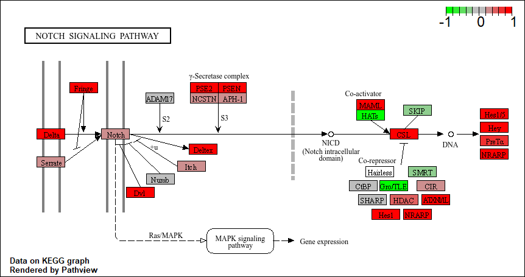

# Class 14: RNASeq mini-project
Grace Wang (PID: A16968688)

- [Required packages](#required-packages)
- [Data import](#data-import)
  - [Tidy counts to match metadata](#tidy-counts-to-match-metadata)
  - [Remove zero count genes](#remove-zero-count-genes)
- [DESeq](#deseq)
  - [Set up DESeq object for
    analysis](#set-up-deseq-object-for-analysis)
  - [Run DESeq analysis](#run-deseq-analysis)
  - [Extract results](#extract-results)
- [Add gene annotations](#add-gene-annotations)
- [Save results to CSV file](#save-results-to-csv-file)
- [Result visualization](#result-visualization)
- [Pathway analysis](#pathway-analysis)
  - [Upregulated pathways](#upregulated-pathways)
  - [Downregulated pathways](#downregulated-pathways)
- [Gene ontology](#gene-ontology)
- [Reactome analysis](#reactome-analysis)
  - [Reactome analysis online](#reactome-analysis-online)

Here we will perform a complete RNASeq analysis from counts to pathways
and biological interpretation.

The data for for hands-on session comes from GEO entry: GSE37704, which
is associated with the following publication:

- Trapnell C, Hendrickson DG, Sauvageau M, Goff L et al. “Differential
  analysis of gene regulation at transcript resolution with RNA-seq”.
  Nat Biotechnol 2013 Jan;31(1):46-53. PMID: 23222703

The authors report on differential analysis of lung fibroblasts in
response to loss of the developmental transcription factor HOXA1. Their
results and others indicate that HOXA1 is required for lung fibroblast
and HeLa cell cycle progression. In particular their analysis show that
“loss of HOXA1 results in significant expression level changes in
thousands of individual transcripts, along with isoform switching events
in key regulators of the cell cycle”. For our session we have used their
Sailfish gene-level estimated counts and hence are restricted to
protein-coding genes only.

# Required packages

``` r
library(DESeq2)
library(AnnotationDbi)
library(org.Hs.eg.db)
library(pathview)
library(gage)
library(gageData)
library(ggplot2)
library(ggrepel)
```

# Data import

``` r
countData <- read.csv("GSE37704_featurecounts.csv", row.names = 1)
colData <- read.csv("GSE37704_metadata.csv", row.names = 1)
```

``` r
head(countData)
```

                    length SRR493366 SRR493367 SRR493368 SRR493369 SRR493370
    ENSG00000186092    918         0         0         0         0         0
    ENSG00000279928    718         0         0         0         0         0
    ENSG00000279457   1982        23        28        29        29        28
    ENSG00000278566    939         0         0         0         0         0
    ENSG00000273547    939         0         0         0         0         0
    ENSG00000187634   3214       124       123       205       207       212
                    SRR493371
    ENSG00000186092         0
    ENSG00000279928         0
    ENSG00000279457        46
    ENSG00000278566         0
    ENSG00000273547         0
    ENSG00000187634       258

``` r
head(colData)
```

                  condition
    SRR493366 control_sirna
    SRR493367 control_sirna
    SRR493368 control_sirna
    SRR493369      hoxa1_kd
    SRR493370      hoxa1_kd
    SRR493371      hoxa1_kd

## Tidy counts to match metadata

Check the correspondence of colData rows and countData columns

``` r
rownames(colData)
```

    [1] "SRR493366" "SRR493367" "SRR493368" "SRR493369" "SRR493370" "SRR493371"

``` r
colnames(countData)
```

    [1] "length"    "SRR493366" "SRR493367" "SRR493368" "SRR493369" "SRR493370"
    [7] "SRR493371"

Remove the first column so we can match the metadata

``` r
counts <- countData[, rownames(colData)]
head(counts)
```

                    SRR493366 SRR493367 SRR493368 SRR493369 SRR493370 SRR493371
    ENSG00000186092         0         0         0         0         0         0
    ENSG00000279928         0         0         0         0         0         0
    ENSG00000279457        23        28        29        29        28        46
    ENSG00000278566         0         0         0         0         0         0
    ENSG00000273547         0         0         0         0         0         0
    ENSG00000187634       124       123       205       207       212       258

``` r
all(rownames(colData) == colnames(counts))
```

    [1] TRUE

## Remove zero count genes

We will have rows in `counts` for genes that we cannot say anything
about because they have zero expression in the particular tissue we are
looking at.

If `rowSums` is zero for a given gene, then it has no count data and we
should exclude that gene from further consideration.

``` r
to.keep <- rowSums(counts) != 0

cleancounts <- counts[to.keep, ]
head(cleancounts)
```

                    SRR493366 SRR493367 SRR493368 SRR493369 SRR493370 SRR493371
    ENSG00000279457        23        28        29        29        28        46
    ENSG00000187634       124       123       205       207       212       258
    ENSG00000188976      1637      1831      2383      1226      1326      1504
    ENSG00000187961       120       153       180       236       255       357
    ENSG00000187583        24        48        65        44        48        64
    ENSG00000187642         4         9        16        14        16        16

> Q: How many genes do we have left?

``` r
nrow(cleancounts)
```

    [1] 15975

# DESeq

## Set up DESeq object for analysis

``` r
dds <- DESeqDataSetFromMatrix(countData = cleancounts, 
                              colData = colData, 
                              design = ~condition)
```

    Warning in DESeqDataSet(se, design = design, ignoreRank): some variables in
    design formula are characters, converting to factors

## Run DESeq analysis

``` r
dds <- DESeq(dds)
```

    estimating size factors

    estimating dispersions

    gene-wise dispersion estimates

    mean-dispersion relationship

    final dispersion estimates

    fitting model and testing

## Extract results

``` r
res <- results(dds)
head(res)
```

    log2 fold change (MLE): condition hoxa1 kd vs control sirna 
    Wald test p-value: condition hoxa1 kd vs control sirna 
    DataFrame with 6 rows and 6 columns
                     baseMean log2FoldChange     lfcSE       stat      pvalue
                    <numeric>      <numeric> <numeric>  <numeric>   <numeric>
    ENSG00000279457   29.9136      0.1792571 0.3248216   0.551863 5.81042e-01
    ENSG00000187634  183.2296      0.4264571 0.1402658   3.040350 2.36304e-03
    ENSG00000188976 1651.1881     -0.6927205 0.0548465 -12.630158 1.43990e-36
    ENSG00000187961  209.6379      0.7297556 0.1318599   5.534326 3.12428e-08
    ENSG00000187583   47.2551      0.0405765 0.2718928   0.149237 8.81366e-01
    ENSG00000187642   11.9798      0.5428105 0.5215598   1.040744 2.97994e-01
                           padj
                      <numeric>
    ENSG00000279457 6.86555e-01
    ENSG00000187634 5.15718e-03
    ENSG00000188976 1.76549e-35
    ENSG00000187961 1.13413e-07
    ENSG00000187583 9.19031e-01
    ENSG00000187642 4.03379e-01

# Add gene annotations

``` r
res$symbol <- mapIds(x = org.Hs.eg.db, 
                     keys = rownames(res), 
                     keytype = "ENSEMBL", 
                     column = "SYMBOL")
```

    'select()' returned 1:many mapping between keys and columns

``` r
res$name <- mapIds(x = org.Hs.eg.db, 
                   keys = rownames(res), 
                   keytype = "ENSEMBL", 
                   column = "GENENAME")
```

    'select()' returned 1:many mapping between keys and columns

``` r
res$entrez <- mapIds(x = org.Hs.eg.db, 
                     keys = rownames(res), 
                     keytype = "ENSEMBL", 
                     column = "ENTREZID")
```

    'select()' returned 1:many mapping between keys and columns

``` r
head(res)
```

    log2 fold change (MLE): condition hoxa1 kd vs control sirna 
    Wald test p-value: condition hoxa1 kd vs control sirna 
    DataFrame with 6 rows and 9 columns
                     baseMean log2FoldChange     lfcSE       stat      pvalue
                    <numeric>      <numeric> <numeric>  <numeric>   <numeric>
    ENSG00000279457   29.9136      0.1792571 0.3248216   0.551863 5.81042e-01
    ENSG00000187634  183.2296      0.4264571 0.1402658   3.040350 2.36304e-03
    ENSG00000188976 1651.1881     -0.6927205 0.0548465 -12.630158 1.43990e-36
    ENSG00000187961  209.6379      0.7297556 0.1318599   5.534326 3.12428e-08
    ENSG00000187583   47.2551      0.0405765 0.2718928   0.149237 8.81366e-01
    ENSG00000187642   11.9798      0.5428105 0.5215598   1.040744 2.97994e-01
                           padj      symbol                   name      entrez
                      <numeric> <character>            <character> <character>
    ENSG00000279457 6.86555e-01          NA                     NA          NA
    ENSG00000187634 5.15718e-03      SAMD11 sterile alpha motif ..      148398
    ENSG00000188976 1.76549e-35       NOC2L NOC2 like nucleolar ..       26155
    ENSG00000187961 1.13413e-07      KLHL17 kelch like family me..      339451
    ENSG00000187583 9.19031e-01     PLEKHN1 pleckstrin homology ..       84069
    ENSG00000187642 4.03379e-01       PERM1 PPARGC1 and ESRR ind..       84808

# Save results to CSV file

``` r
write.csv(res, file = "results.csv")
```

# Result visualization

``` r
mycols <- rep("gray", nrow(res))
mycols[res$log2FoldChange <= -2] <- "blue"
mycols[res$log2FoldChange >= 2] <- "blue"
mycols[res$padj >= 0.05] <- "gray"
```

``` r
ggplot(res) + 
  aes(x = log2FoldChange, y = -log(padj), label = symbol) + 
  geom_point(col = mycols) + 
  geom_vline(xintercept = c(-2, 2), col = "red") + 
  geom_hline(yintercept = -log(0.05), col = "red") + 
  labs(x = "Log2(Fold Change)", y = "-Log(adjusted p-value)") + 
  geom_text_repel() + 
  theme_bw()
```

    Warning: Removed 1237 rows containing missing values or values outside the scale range
    (`geom_point()`).

    Warning: Removed 1409 rows containing missing values or values outside the scale range
    (`geom_text_repel()`).

    Warning: ggrepel: 14553 unlabeled data points (too many overlaps). Consider
    increasing max.overlaps


# Pathway analysis

``` r
data("kegg.sets.hs")
data(sigmet.idx.hs)

kegg.sets.hs <- kegg.sets.hs[sigmet.idx.hs]

foldchanges <- res$log2FoldChange
names(foldchanges) <- res$entrez
```

``` r
keggres <- gage(foldchanges, gsets = kegg.sets.hs)
```

## Upregulated pathways

``` r
keggrespathways_up <- rownames(keggres$greater)[1:5]
keggrespathways_up
```

    [1] "hsa04640 Hematopoietic cell lineage"  
    [2] "hsa04630 Jak-STAT signaling pathway"  
    [3] "hsa00140 Steroid hormone biosynthesis"
    [4] "hsa04142 Lysosome"                    
    [5] "hsa04330 Notch signaling pathway"     

``` r
keggresids_up <- substr(keggrespathways_up, start = 1, stop = 8)
keggresids_up
```

    [1] "hsa04640" "hsa04630" "hsa00140" "hsa04142" "hsa04330"

``` r
pathview(gene.data = foldchanges, pathway.id = keggresids_up, species = "hsa")
```

    'select()' returned 1:1 mapping between keys and columns

    Info: Working in directory C:/Users/grace/Desktop/UCSD/4/Spring/BIMM 143/bimm143_github/Class14

    Info: Writing image file hsa04640.pathview.png

    'select()' returned 1:1 mapping between keys and columns

    Info: Working in directory C:/Users/grace/Desktop/UCSD/4/Spring/BIMM 143/bimm143_github/Class14

    Info: Writing image file hsa04630.pathview.png

    'select()' returned 1:1 mapping between keys and columns

    Info: Working in directory C:/Users/grace/Desktop/UCSD/4/Spring/BIMM 143/bimm143_github/Class14

    Info: Writing image file hsa00140.pathview.png

    'select()' returned 1:1 mapping between keys and columns

    Info: Working in directory C:/Users/grace/Desktop/UCSD/4/Spring/BIMM 143/bimm143_github/Class14

    Info: Writing image file hsa04142.pathview.png

    'select()' returned 1:1 mapping between keys and columns

    Info: Working in directory C:/Users/grace/Desktop/UCSD/4/Spring/BIMM 143/bimm143_github/Class14

    Info: Writing image file hsa04330.pathview.png




## Downregulated pathways

``` r
keggrespathways_down <- rownames(keggres$less)[1:5]
keggrespathways_down
```

    [1] "hsa04110 Cell cycle"               "hsa03030 DNA replication"         
    [3] "hsa03013 RNA transport"            "hsa03440 Homologous recombination"
    [5] "hsa04114 Oocyte meiosis"          

``` r
keggresids_down <- substr(keggrespathways_down, start = 1, stop = 8)
keggresids_down
```

    [1] "hsa04110" "hsa03030" "hsa03013" "hsa03440" "hsa04114"

``` r
pathview(gene.data = foldchanges, pathway.id = keggresids_down, species = "hsa")
```

    'select()' returned 1:1 mapping between keys and columns

    Info: Working in directory C:/Users/grace/Desktop/UCSD/4/Spring/BIMM 143/bimm143_github/Class14

    Info: Writing image file hsa04110.pathview.png

    'select()' returned 1:1 mapping between keys and columns

    Info: Working in directory C:/Users/grace/Desktop/UCSD/4/Spring/BIMM 143/bimm143_github/Class14

    Info: Writing image file hsa03030.pathview.png

    'select()' returned 1:1 mapping between keys and columns

    Info: Working in directory C:/Users/grace/Desktop/UCSD/4/Spring/BIMM 143/bimm143_github/Class14

    Info: Writing image file hsa03013.pathview.png

    'select()' returned 1:1 mapping between keys and columns

    Info: Working in directory C:/Users/grace/Desktop/UCSD/4/Spring/BIMM 143/bimm143_github/Class14

    Info: Writing image file hsa03440.pathview.png

    'select()' returned 1:1 mapping between keys and columns

    Info: Working in directory C:/Users/grace/Desktop/UCSD/4/Spring/BIMM 143/bimm143_github/Class14

    Info: Writing image file hsa04114.pathview.png


# Gene ontology

``` r
data(go.sets.hs)
data(go.subs.hs)

gobpsets = go.sets.hs[go.subs.hs$BP]

gobpres = gage(foldchanges, gsets=gobpsets, same.dir=TRUE)

lapply(gobpres, head)
```

    $greater
                                                 p.geomean stat.mean        p.val
    GO:0007156 homophilic cell adhesion       8.519724e-05  3.824205 8.519724e-05
    GO:0002009 morphogenesis of an epithelium 1.396681e-04  3.653886 1.396681e-04
    GO:0048729 tissue morphogenesis           1.432451e-04  3.643242 1.432451e-04
    GO:0007610 behavior                       1.925222e-04  3.565432 1.925222e-04
    GO:0060562 epithelial tube morphogenesis  5.932837e-04  3.261376 5.932837e-04
    GO:0035295 tube development               5.953254e-04  3.253665 5.953254e-04
                                                  q.val set.size         exp1
    GO:0007156 homophilic cell adhesion       0.1951953      113 8.519724e-05
    GO:0002009 morphogenesis of an epithelium 0.1951953      339 1.396681e-04
    GO:0048729 tissue morphogenesis           0.1951953      424 1.432451e-04
    GO:0007610 behavior                       0.1967577      426 1.925222e-04
    GO:0060562 epithelial tube morphogenesis  0.3565320      257 5.932837e-04
    GO:0035295 tube development               0.3565320      391 5.953254e-04

    $less
                                                p.geomean stat.mean        p.val
    GO:0048285 organelle fission             1.536227e-15 -8.063910 1.536227e-15
    GO:0000280 nuclear division              4.286961e-15 -7.939217 4.286961e-15
    GO:0007067 mitosis                       4.286961e-15 -7.939217 4.286961e-15
    GO:0000087 M phase of mitotic cell cycle 1.169934e-14 -7.797496 1.169934e-14
    GO:0007059 chromosome segregation        2.028624e-11 -6.878340 2.028624e-11
    GO:0000236 mitotic prometaphase          1.729553e-10 -6.695966 1.729553e-10
                                                    q.val set.size         exp1
    GO:0048285 organelle fission             5.841698e-12      376 1.536227e-15
    GO:0000280 nuclear division              5.841698e-12      352 4.286961e-15
    GO:0007067 mitosis                       5.841698e-12      352 4.286961e-15
    GO:0000087 M phase of mitotic cell cycle 1.195672e-11      362 1.169934e-14
    GO:0007059 chromosome segregation        1.658603e-08      142 2.028624e-11
    GO:0000236 mitotic prometaphase          1.178402e-07       84 1.729553e-10

    $stats
                                              stat.mean     exp1
    GO:0007156 homophilic cell adhesion        3.824205 3.824205
    GO:0002009 morphogenesis of an epithelium  3.653886 3.653886
    GO:0048729 tissue morphogenesis            3.643242 3.643242
    GO:0007610 behavior                        3.565432 3.565432
    GO:0060562 epithelial tube morphogenesis   3.261376 3.261376
    GO:0035295 tube development                3.253665 3.253665

# Reactome analysis

## Reactome analysis online

We need to make a file of our significant genes that we can upload to
the reactome webpage (<https://reactome.org/PathwayBrowser/#TOOL=AT>).

``` r
sig_genes <- res[res$padj <= 0.05 & !is.na(res$padj), "symbol"]
print(paste("Total number of significant genes:", length(sig_genes)))
```

    [1] "Total number of significant genes: 8147"

``` r
write.table(sig_genes, file="significant_genes.txt", row.names=FALSE, col.names=FALSE, quote=FALSE)
```


