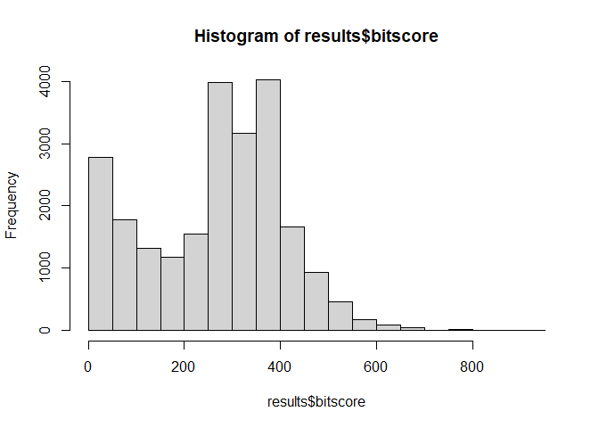
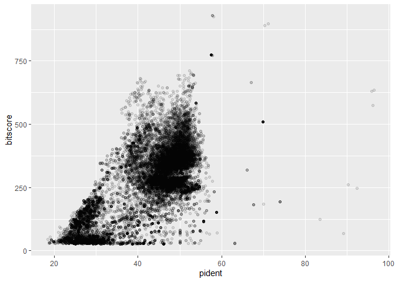
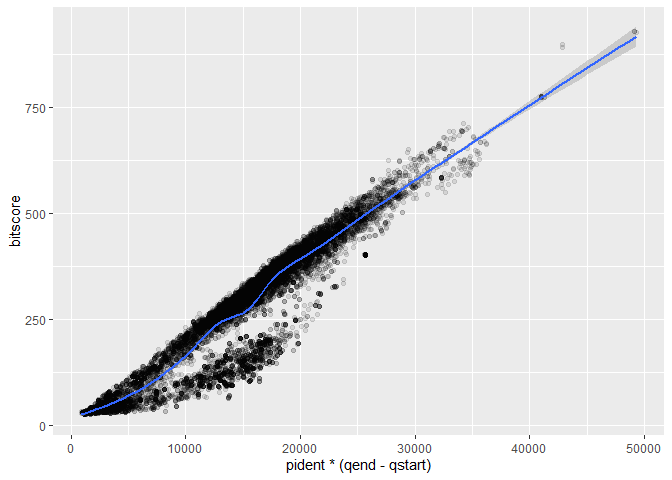

# Class 16
Grace Wang (PID: A16968688)

``` r
library(ggplot2)
```

``` r
results <- read.table("results.tsv", 
                      col.names = c("qseqid", "sseqid", "pident", "length", "mismatch", "gapopen", "qstart", "qend", "sstart", "send", "evalue", "bitscore"))
```

``` r
hist(results$bitscore, breaks = 30)
```



There are a few hits with very high bitscores, but the rest of the
bitscores seem to be centered around ~350 with another peak close to 0.

``` r
ggplot(results) + 
  aes(pident, bitscore) + 
  geom_point(alpha = 0.1)
```



``` r
ggplot(results) + 
  aes(pident * (qend - qstart), bitscore) + 
  geom_point(alpha = 0.1) + 
  geom_smooth()
```

    `geom_smooth()` using method = 'gam' and formula = 'y ~ s(x, bs = "cs")'



Multiplying percent identity by alignment length reveals a strong
relationship between scaled percent identity and bitscore.
