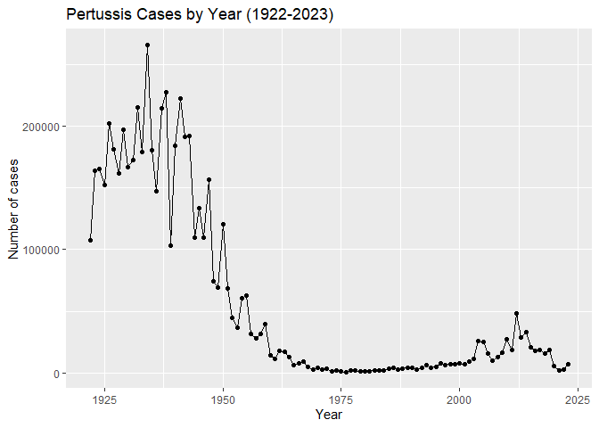
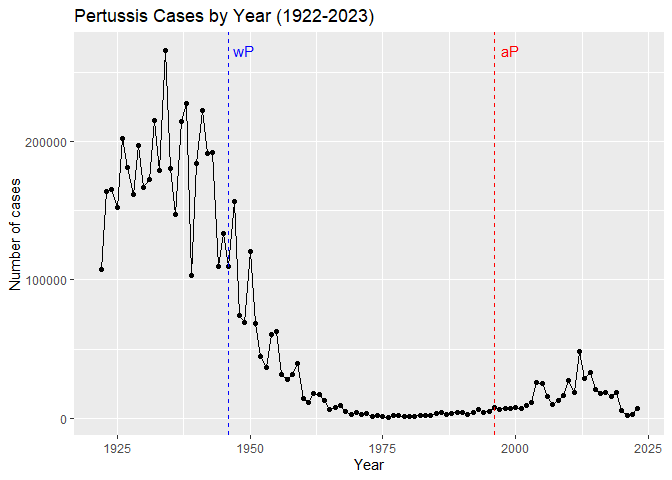
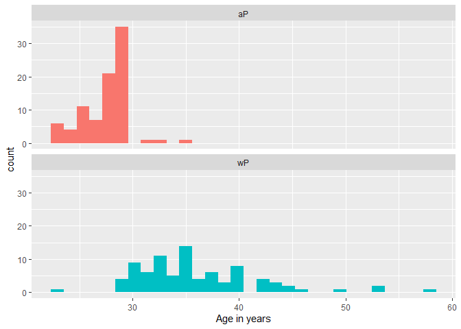
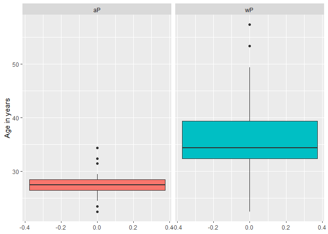
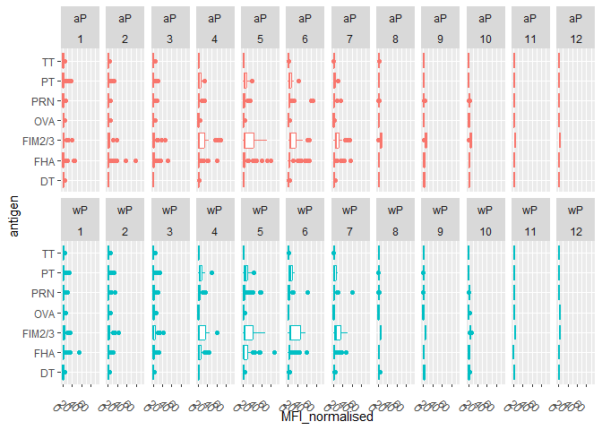
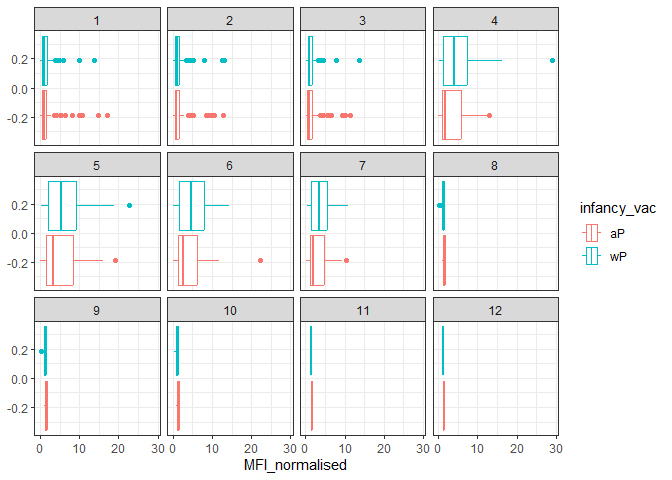
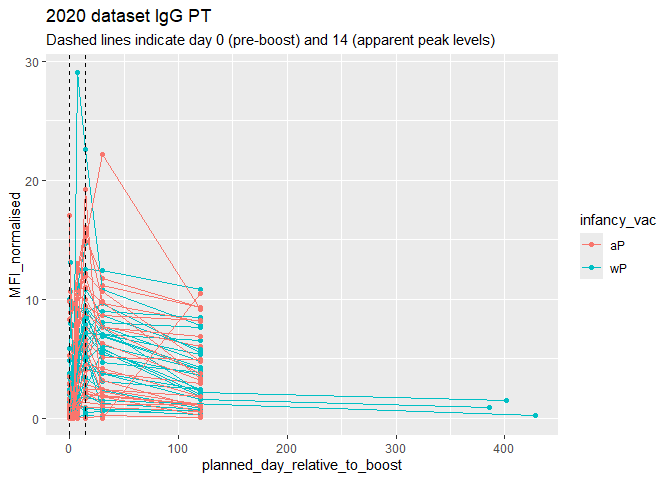
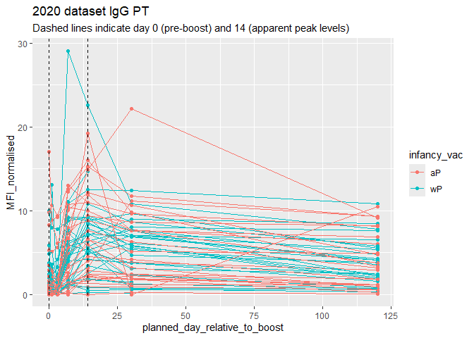

# Class 18: Pertussis Mini-project
Grace Wang (PID: A16968688)

- [Investigating pertussis cases by
  year](#investigating-pertussis-cases-by-year)
- [A tale of two vaccines](#a-tale-of-two-vaccines)
- [Exploring CMI-PB data](#exploring-cmi-pb-data)
- [Examine IgG Ab titer levels](#examine-igg-ab-titer-levels)

``` r
library(ggplot2)
library(jsonlite)
library(lubridate)
library(dplyr)
```

Pertussis (more commonly known as whooping cough) is a highly contagious
respiratory disease caused by the bacterium Bordetella pertussis. People
of all ages can be infected leading to violent coughing fits followed by
a characteristic high-pitched “whoop” like intake of breath. Children
have the highest risk for severe complications and death. Recent
estimates from the WHO indicate that ~16 million cases and 200,000
infant deaths are due to pertussis annually.

## Investigating pertussis cases by year

``` r
#install.packages("datapasta")

cdc <- data.frame(Year = c(1922L,
                           1923L,1924L,1925L,1926L,1927L,1928L,
                           1929L,1930L,1931L,1932L,1933L,1934L,1935L,
                           1936L,1937L,1938L,1939L,1940L,1941L,
                           1942L,1943L,1944L,1945L,1946L,1947L,1948L,
                           1949L,1950L,1951L,1952L,1953L,1954L,
                           1955L,1956L,1957L,1958L,1959L,1960L,
                           1961L,1962L,1963L,1964L,1965L,1966L,1967L,
                           1968L,1969L,1970L,1971L,1972L,1973L,
                           1974L,1975L,1976L,1977L,1978L,1979L,1980L,
                           1981L,1982L,1983L,1984L,1985L,1986L,
                           1987L,1988L,1989L,1990L,1991L,1992L,1993L,
                           1994L,1995L,1996L,1997L,1998L,1999L,
                           2000L,2001L,2002L,2003L,2004L,2005L,
                           2006L,2007L,2008L,2009L,2010L,2011L,2012L,
                           2013L,2014L,2015L,2016L,2017L,2018L,
                           2019L,2020L,2021L,2022L,2023L),
                  No..Reported.Pertussis.Cases = c(107473,
                           164191,165418,152003,202210,181411,
                           161799,197371,166914,172559,215343,179135,
                           265269,180518,147237,214652,227319,103188,
                           183866,222202,191383,191890,109873,
                           133792,109860,156517,74715,69479,120718,
                           68687,45030,37129,60886,62786,31732,28295,
                           32148,40005,14809,11468,17749,17135,
                           13005,6799,7717,9718,4810,3285,4249,
                           3036,3287,1759,2402,1738,1010,2177,2063,
                           1623,1730,1248,1895,2463,2276,3589,
                           4195,2823,3450,4157,4570,2719,4083,6586,
                           4617,5137,7796,6564,7405,7298,7867,
                           7580,9771,11647,25827,25616,15632,10454,
                           13278,16858,27550,18719,48277,28639,
                           32971,20762,17972,18975,15609,18617,6124,
                           2116,3044,7063)
)
```

> Q1: With the help of the R “addin” package `datapasta` assign the CDC
> pertussis case number data to a data frame called `cdc` and use
> **ggplot** to make a plot of cases numbers over time.

``` r
options(scipen = 999)
plot <- ggplot(cdc) + 
        aes(x = Year, y = No..Reported.Pertussis.Cases) + 
        geom_point() + 
        geom_line() + 
        labs(x = "Year", y = "Number of cases", title = "Pertussis Cases by Year (1922-2023)")
plot
```



## A tale of two vaccines

Two types of pertussis vaccines have been developed: **whole-cell
pertussis (wP)** and **acellular pertussis (aP)**. The first vaccines
were composed of ‘whole cell’ (wP) inactivated bacteria. The latter aP
vaccines use purified antigens of the bacteria (the most important
pertussis components for our immune system). These aP vaccines were
developed to have less side effects than the older wP vaccines and are
now the only form administered in the United States.

> Q2: Using the ggplot `geom_vline()` function add lines to your
> previous plot for the 1946 introduction of the wP vaccine and the 1996
> switch to aP vaccine (see example in the hint below). What do you
> notice?

``` r
plot + 
  geom_vline(xintercept = 1946, col = "blue", linetype = 2) + 
  annotate("text", label = "wP", 
           x = 1946 + 3, y = max(cdc$No..Reported.Pertussis.Cases), col = "blue") + 
  geom_vline(xintercept = 1996, col = "red", linetype = 2) + 
  annotate("text", label = "aP", 
           x = 1996 + 3, y = max(cdc$No..Reported.Pertussis.Cases), col = "red")
```



> Q3: Describe what happened after the introduction of the aP vaccine?
> Do you have a possible explanation for the observed trend?

After the introduction of the aP vaccine, the number of cases rose again
despite declining after the introduction of the wP vaccine. This could
be because people were skeptical of the new vaccine and chose not to use
it. This could also be because some strains of the bacterium evolved to
acquire immunity from the vaccine, resulting in more cases.

## Exploring CMI-PB data

The new and ongoing CMI-PB project aims to provide the scientific
community with this very information. In particular, CMI-PB tracks and
makes freely available long-term humoral and cellular immune response
data for a large number of individuals who received either DTwP or DTaP
combination vaccines in infancy followed by Tdap booster vaccinations.
This includes complete API access to longitudinal RNA-Seq, AB Titer,
Olink, and live cell assay results directly from their website:
<https://www.cmi-pb.org/>.

``` r
subject <- read_json("https://www.cmi-pb.org/api/subject", simplifyVector = TRUE) 

head(subject)
```

      subject_id infancy_vac biological_sex              ethnicity  race
    1          1          wP         Female Not Hispanic or Latino White
    2          2          wP         Female Not Hispanic or Latino White
    3          3          wP         Female                Unknown White
    4          4          wP           Male Not Hispanic or Latino Asian
    5          5          wP           Male Not Hispanic or Latino Asian
    6          6          wP         Female Not Hispanic or Latino White
      year_of_birth date_of_boost      dataset
    1    1986-01-01    2016-09-12 2020_dataset
    2    1968-01-01    2019-01-28 2020_dataset
    3    1983-01-01    2016-10-10 2020_dataset
    4    1988-01-01    2016-08-29 2020_dataset
    5    1991-01-01    2016-08-29 2020_dataset
    6    1988-01-01    2016-10-10 2020_dataset

> Q4: How many aP and wP infancy vaccinated subjects are in the dataset?

``` r
table(subject$infancy_vac)
```


    aP wP 
    87 85 

> Q5: How many Male and Female subjects/patients are in the dataset?

``` r
table(subject$biological_sex)
```


    Female   Male 
       112     60 

> Q6: What is the breakdown of race and biological sex (e.g. number of
> Asian females, White males etc…)?

``` r
table(subject$biological_sex, subject$race)
```

            
             American Indian/Alaska Native Asian Black or African American
      Female                             0    32                         2
      Male                               1    12                         3
            
             More Than One Race Native Hawaiian or Other Pacific Islander
      Female                 15                                         1
      Male                    4                                         1
            
             Unknown or Not Reported White
      Female                      14    48
      Male                         7    32

> Q7: Using this approach determine (i) the average age of wP
> individuals, (ii) the average age of aP individuals; and (iii) are
> they significantly different?

``` r
subject$age <- today() - ymd(subject$year_of_birth)
```

``` r
wp <- subject %>% filter(infancy_vac == "wP")
ap <- subject %>% filter(infancy_vac == "aP")

summary(time_length(wp$age, "years"))
```

       Min. 1st Qu.  Median    Mean 3rd Qu.    Max. 
      22.43   32.42   34.43   36.07   39.43   57.43 

``` r
summary(time_length(ap$age, "years"))
```

       Min. 1st Qu.  Median    Mean 3rd Qu.    Max. 
      22.43   26.43   27.43   27.32   28.42   34.43 

``` r
t.test(time_length(wp$age, "years"), time_length(ap$age, "years"))
```


        Welch Two Sample t-test

    data:  time_length(wp$age, "years") and time_length(ap$age, "years")
    t = 12.918, df = 104.03, p-value < 0.00000000000000022
    alternative hypothesis: true difference in means is not equal to 0
    95 percent confidence interval:
      7.407351 10.094058
    sample estimates:
    mean of x mean of y 
     36.07247  27.32177 

The p-value for the t-test is very small, so the average ages of wP and
aP individuals are significantly different from each other.

> Q8: Determine the age of all individuals at time of boost?

``` r
subject$age_at_boost <- time_length(ymd(subject$date_of_boost)- ymd(subject$year_of_birth), "years")

head(subject$age_at_boost)
```

    [1] 30.69678 51.07461 33.77413 28.65982 25.65914 28.77481

> Q9: With the help of a faceted boxplot or histogram, do you think
> these two groups are significantly different?

``` r
ggplot(subject) +
  aes(time_length(age, "year"),
      fill=as.factor(infancy_vac)) +
  geom_histogram(show.legend=FALSE) +
  facet_wrap(vars(infancy_vac), nrow=2) +
  xlab("Age in years")
```

    `stat_bin()` using `bins = 30`. Pick better value with `binwidth`.



``` r
ggplot(subject) +
  aes(y = time_length(age, "year"),
      fill=as.factor(infancy_vac)) +
  geom_boxplot(show.legend = FALSE) +
  facet_wrap(vars(infancy_vac), ncol=2) +
  ylab("Age in years")
```



``` r
specimen <- read_json("https://www.cmi-pb.org/api/specimen", simplifyVector = TRUE)
titer <- read_json("https://www.cmi-pb.org/api/plasma_ab_titer", simplifyVector = TRUE)
```

> Q10: Complete the code to join `specimen` and `subject` tables to make
> a new merged data frame containing all specimen records along with
> their associated subject details:

``` r
meta <- inner_join(specimen, subject)
```

    Joining with `by = join_by(subject_id)`

``` r
dim(meta)
```

    [1] 1503   15

``` r
head(meta)
```

      specimen_id subject_id actual_day_relative_to_boost
    1           1          1                           -3
    2           2          1                            1
    3           3          1                            3
    4           4          1                            7
    5           5          1                           11
    6           6          1                           32
      planned_day_relative_to_boost specimen_type visit infancy_vac biological_sex
    1                             0         Blood     1          wP         Female
    2                             1         Blood     2          wP         Female
    3                             3         Blood     3          wP         Female
    4                             7         Blood     4          wP         Female
    5                            14         Blood     5          wP         Female
    6                            30         Blood     6          wP         Female
                   ethnicity  race year_of_birth date_of_boost      dataset
    1 Not Hispanic or Latino White    1986-01-01    2016-09-12 2020_dataset
    2 Not Hispanic or Latino White    1986-01-01    2016-09-12 2020_dataset
    3 Not Hispanic or Latino White    1986-01-01    2016-09-12 2020_dataset
    4 Not Hispanic or Latino White    1986-01-01    2016-09-12 2020_dataset
    5 Not Hispanic or Latino White    1986-01-01    2016-09-12 2020_dataset
    6 Not Hispanic or Latino White    1986-01-01    2016-09-12 2020_dataset
             age age_at_boost
    1 14400 days     30.69678
    2 14400 days     30.69678
    3 14400 days     30.69678
    4 14400 days     30.69678
    5 14400 days     30.69678
    6 14400 days     30.69678

> Q11: Now using the same procedure join `meta` with `tite`r data so we
> can further analyze this data in terms of time of visit aP/wP,
> male/female etc.

``` r
abdata <- inner_join(titer, meta)
```

    Joining with `by = join_by(specimen_id)`

``` r
dim(abdata)
```

    [1] 52576    22

> Q12: How many specimens (i.e. entries in `abdata`) do we have for each
> `isotype`?

``` r
table(abdata$isotype)
```


      IgE   IgG  IgG1  IgG2  IgG3  IgG4 
     6698  5389 10117 10124 10124 10124 

> Q13: What are the different `$dataset` values in `abdata` and what do
> you notice about the number of rows for the most “recent” dataset?

``` r
table(abdata$dataset)
```


    2020_dataset 2021_dataset 2022_dataset 2023_dataset 
           31520         8085         7301         5670 

The `$dataset` values show what year the data were collected, with the
2020 dataset presumably including previous years as well. The number of
rows for the most recent dataset, 2023, is the smallest, likely because
more data is being collected or entered. Alternatively, this could be
because there were just fewer people in the most recent dataset as the
number of subjects has been decreasing over time.
(abdata$subject_id, abdata$dataset)

## Examine IgG Ab titer levels

``` r
igg <- abdata %>% filter(isotype == "IgG")
head(igg)
```

      specimen_id isotype is_antigen_specific antigen        MFI MFI_normalised
    1           1     IgG                TRUE      PT   68.56614       3.736992
    2           1     IgG                TRUE     PRN  332.12718       2.602350
    3           1     IgG                TRUE     FHA 1887.12263      34.050956
    4          19     IgG                TRUE      PT   20.11607       1.096366
    5          19     IgG                TRUE     PRN  976.67419       7.652635
    6          19     IgG                TRUE     FHA   60.76626       1.096457
       unit lower_limit_of_detection subject_id actual_day_relative_to_boost
    1 IU/ML                 0.530000          1                           -3
    2 IU/ML                 6.205949          1                           -3
    3 IU/ML                 4.679535          1                           -3
    4 IU/ML                 0.530000          3                           -3
    5 IU/ML                 6.205949          3                           -3
    6 IU/ML                 4.679535          3                           -3
      planned_day_relative_to_boost specimen_type visit infancy_vac biological_sex
    1                             0         Blood     1          wP         Female
    2                             0         Blood     1          wP         Female
    3                             0         Blood     1          wP         Female
    4                             0         Blood     1          wP         Female
    5                             0         Blood     1          wP         Female
    6                             0         Blood     1          wP         Female
                   ethnicity  race year_of_birth date_of_boost      dataset
    1 Not Hispanic or Latino White    1986-01-01    2016-09-12 2020_dataset
    2 Not Hispanic or Latino White    1986-01-01    2016-09-12 2020_dataset
    3 Not Hispanic or Latino White    1986-01-01    2016-09-12 2020_dataset
    4                Unknown White    1983-01-01    2016-10-10 2020_dataset
    5                Unknown White    1983-01-01    2016-10-10 2020_dataset
    6                Unknown White    1983-01-01    2016-10-10 2020_dataset
             age age_at_boost
    1 14400 days     30.69678
    2 14400 days     30.69678
    3 14400 days     30.69678
    4 15496 days     33.77413
    5 15496 days     33.77413
    6 15496 days     33.77413

> Q14: Complete the following code to make a summary boxplot of Ab titer
> levels (MFI) for all antigens:

``` r
ggplot(igg) +
  aes(MFI_normalised, antigen) +
  geom_boxplot() + 
  xlim(0,75) +
  facet_wrap(vars(visit), nrow=2)
```

    Warning: Removed 5 rows containing non-finite outside the scale range
    (`stat_boxplot()`).


> Q15: What antigens show differences in the level of IgG antibody
> titers recognizing them over time? Why these and not others?

The antigens PT and FIM2/3 show the most difference in IgG antibody
recognition over time. A few others have some variation, but only in
outliers. PT is the pertussis toxin complex, so it makes sense that it
would have varying recognition over time. FIM2/3 is a mixture of
fimbrial proteins 2 and 3, which are serotypes of a *B. pertussis*
protein that seems to be important in attaching to host cells.

``` r
ggplot(igg) +
  aes(MFI_normalised, antigen, col=infancy_vac ) +
  geom_boxplot(show.legend = FALSE) + 
  facet_wrap(vars(visit), nrow=2) +
  xlim(0,75) +
  theme_bw()
```

    Warning: Removed 5 rows containing non-finite outside the scale range
    (`stat_boxplot()`).


``` r
igg %>% 
  ggplot() +
    aes(MFI_normalised, antigen, col=infancy_vac ) +
    geom_boxplot(show.legend = FALSE) + 
    xlim(0,75) +
    facet_wrap(vars(infancy_vac, visit), nrow=2) + 
    theme(axis.text.x = element_text(angle = -45, hjust=1))
```

    Warning: Removed 5 rows containing non-finite outside the scale range
    (`stat_boxplot()`).



> Q16: Filter to pull out only two specific antigens for analysis and
> create a boxplot for each. You can chose any you like. Below I picked
> a “control” antigen (“**OVA**”, that is not in our vaccines) and a
> clear antigen of interest (“**PT**”, Pertussis Toxin, one of the key
> virulence factors produced by the bacterium B. pertussis).

``` r
filter(igg, antigen == "PT") %>%
  ggplot() +
  aes(MFI_normalised, col=infancy_vac) +
  geom_boxplot(show.legend = T) +
  facet_wrap(vars(visit)) +
  theme_bw()
```



``` r
filter(igg, antigen == "OVA") %>%
  ggplot() +
  aes(MFI_normalised, col=infancy_vac) +
  geom_boxplot(show.legend = T) +
  facet_wrap(vars(visit)) +
  theme_bw()
```


> Q17: What do you notice about these two antigens time courses and the
> PT data in particular?

OVA changes are on a much smaller scale than are PT changes and look
roughly the same over time. PT starts with low MFI but rises to peak
around the 5th or 6th visit, then falls back down.

> Q18: Do you see any clear difference in aP vs. wP responses?

PT levels in wP individuals might be slightly higher when PT levels
peak, but the different does not look significant.

``` r
abdata.21 <- abdata %>% filter(dataset == "2021_dataset")

abdata.21 %>% 
  filter(isotype == "IgG",  antigen == "PT") %>%
  ggplot() +
    aes(x=planned_day_relative_to_boost,
        y=MFI_normalised,
        col=infancy_vac,
        group=subject_id) +
    geom_point() +
    geom_line() +
    geom_vline(xintercept=0, linetype="dashed") +
    geom_vline(xintercept=14, linetype="dashed") +
  labs(title="2021 dataset IgG PT",
       subtitle = "Dashed lines indicate day 0 (pre-boost) and 14 (apparent peak levels)")
```


> Q19: Does this trend look similar for the 2020 dataset?

``` r
abdata.20 <- abdata %>% filter(dataset == "2020_dataset")

abdata.20 %>% 
  filter(isotype == "IgG",  antigen == "PT") %>%
  ggplot() +
    aes(x=planned_day_relative_to_boost,
        y=MFI_normalised,
        col=infancy_vac,
        group=subject_id) +
    geom_point() +
    geom_line() +
    geom_vline(xintercept=0, linetype="dashed") +
    geom_vline(xintercept=14, linetype="dashed") +
  labs(title="2020 dataset IgG PT",
       subtitle = "Dashed lines indicate day 0 (pre-boost) and 14 (apparent peak levels)")
```



``` r
abdata.20 %>% 
  filter(isotype == "IgG",  antigen == "PT") %>%
  ggplot() +
    aes(x=planned_day_relative_to_boost,
        y=MFI_normalised,
        col=infancy_vac,
        group=subject_id) +
    geom_point() +
    geom_line() +
    geom_vline(xintercept=0, linetype="dashed") +
    geom_vline(xintercept=14, linetype="dashed") +
  labs(title="2020 dataset IgG PT",
       subtitle = "Dashed lines indicate day 0 (pre-boost) and 14 (apparent peak levels)") + 
  xlim(0, 120)
```

    Warning: Removed 3 rows containing missing values or values outside the scale range
    (`geom_point()`).

    Warning: Removed 3 rows containing missing values or values outside the scale range
    (`geom_line()`).



The 2020 dataset is much messier. It looks like most of the individuals
have PT antigen peaks before 14 days, although it’s hard to tell because
of how many datapoints there are. There are also individuals with peaks
at or after 14 days, resulting in crossing in the lines. There is also
an individual with a peak at 14 days but who also has increasing PT
antigen levels after around 28 days, which might have a data entry
error. Overall, the trend looks different from the 2021 dataset, which
could be partly because I think the 2020 dataset also includes previous
years.
